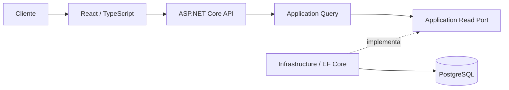
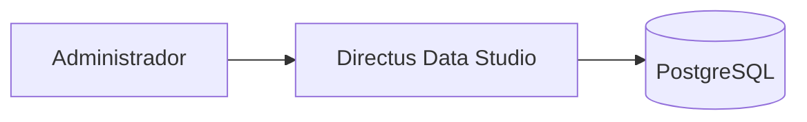
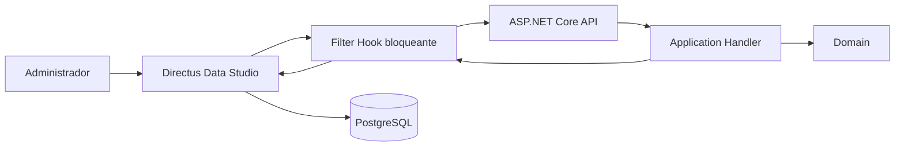
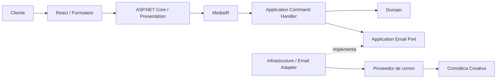
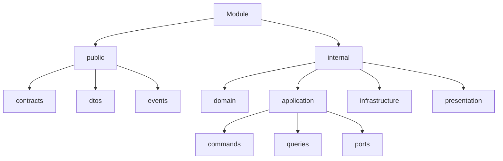
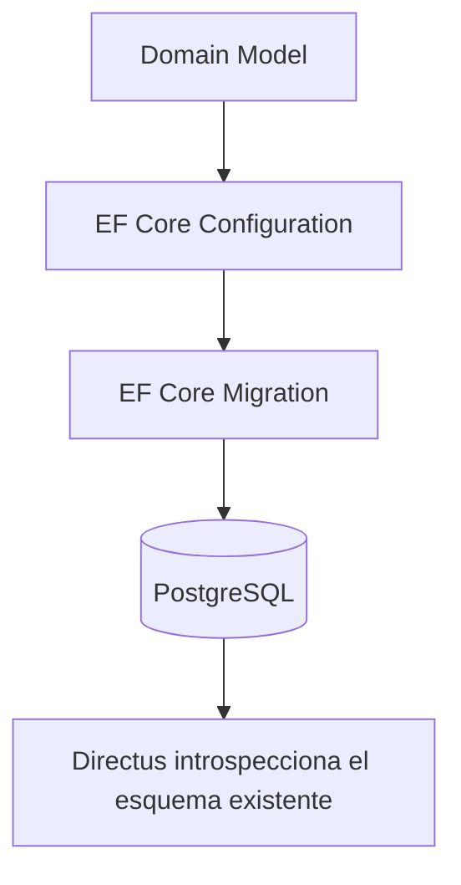
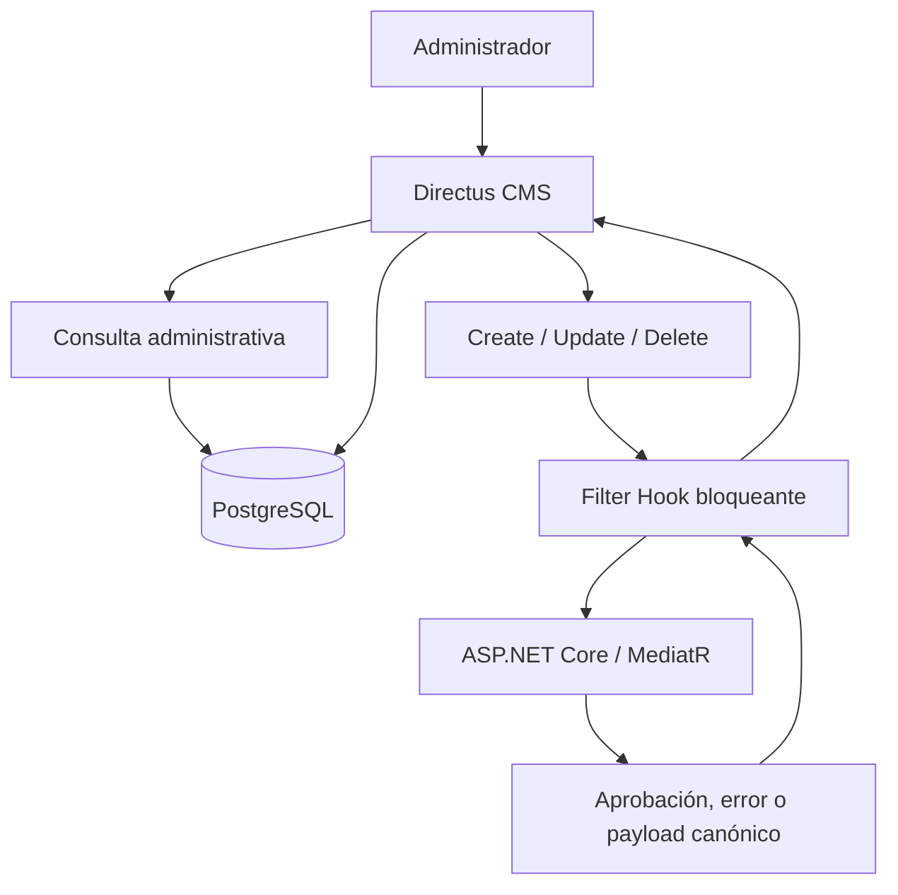

# Cromática Creativa - Sitio Web Corporativo

Sitio web corporativo oficial de Cromática Creativa, concebido como un monorepo con frontend React, API ASP.NET Core, PostgreSQL y Directus como backoffice de contenido.


## Descripción

La aplicación permitirá consultar información pública de Cromática Creativa: información general, misión, visión, servicios, proyectos y su contenido multimedia, clientes, datos de contacto, ubicación, redes sociales y futuro contenido corporativo. La V1 incluirá además un formulario público para que el Cliente envíe por correo una solicitud de contacto a la empresa.

El producto estará compuesto por una aplicación web pública en React, una API oficial en ASP.NET Core, PostgreSQL para los datos del dominio y una instancia self-hosted de Directus conectada al esquema existente como backoffice administrativo.

El actor público definido por el ERS es el **Cliente**. En esta versión, Cliente no significa usuario registrado: no tiene cuenta, registro, login, perfil, roles ni permisos persistidos; consulta contenido público y puede enviar el formulario de contacto mediante React, siempre a través de ASP.NET Core. El **Administrador** es el personal autorizado de Cromática Creativa que gestiona contenido mediante Directus.

## Contexto

Cromática Creativa necesita una presencia web corporativa cuyo contenido dinámico pueda ser gestionado por el Administrador sin desarrollar un panel propio. Directus cubrirá ese backoffice y se conectará directamente a PostgreSQL; Entity Framework Core conservará la autoridad exclusiva sobre el esquema del dominio. Antes de cada mutación administrativa, un Filter Hook bloqueante solicitará a ASP.NET Core que la valide, procese y, cuando corresponda, normalice.

Los Clientes Corporativos mostrados en el portafolio y gestionados conceptualmente por el módulo `CorporateClients` son contenido institucional. No deben confundirse con el actor funcional **Cliente** que consulta el sitio sin autenticación.

## Tipo de proyecto

- Monorepo.
- Monolito modular con un único deployment de backend.
- Arquitectura hexagonal por módulo.
- API REST en ASP.NET Core.
- Aplicación web pública independiente en React.
- CMS Directus self-hosted conectado al esquema PostgreSQL administrado por EF Core.

## Objetivos

- Presentar información corporativa, misión, visión, servicios y demás contenido institucional.
- Publicar proyectos realizados y sus imágenes o videos asociados.
- Mostrar clientes corporativos, ubicación, medios de contacto y redes sociales.
- Permitir que el Cliente consulte contenido público sin autenticación.
- Permitir que el Cliente envíe sin autenticación una solicitud de contacto por correo a Cromática Creativa.
- Permitir que el Administrador gestione contenido mediante Directus sin desarrollar un panel propio.
- Mantener el esquema de PostgreSQL controlado y versionado mediante Entity Framework Core.

## Alcance actual

Incluido en la visión inicial:

- Consulta de contenido corporativo por el Cliente, sin autenticación.
- Proyectos, Clientes Corporativos, servicios, contacto, redes sociales y ubicación.
- Contenido multimedia asociado donde corresponda.
- Formulario público con motivo de contacto, servicio ofrecido seleccionado y datos suficientes para que la empresa responda al Cliente.
- Envío de la solicitud por correo mediante ASP.NET Core y un port implementado por Infrastructure, sin participación de Directus.
- API pública como única fuente de datos del frontend.
- Edición de contenido mediante Directus por el Administrador.

Fuera del alcance de la primera versión:

- Comercio electrónico y pagos en línea.
- Registro, cuentas, login, perfiles, roles o permisos persistidos para el Cliente.
- Interacción entre Clientes mediante cuentas.
- Autenticación, roles o permisos propios de ASP.NET Core.
- Panel administrativo propio o desarrollado en React.

## Contenido estático y dinámico

Permanece definido en código por su baja frecuencia de cambio:

- Misión y visión.
- Descripción institucional general.
- Eslóganes y textos corporativos estáticos.

Se administra dinámicamente mediante Directus. Las lecturas administrativas consultan PostgreSQL directamente; las mutaciones se procesan primero mediante Filter Hooks y casos de uso de ASP.NET Core:

- Proyectos y su multimedia.
- Clientes Corporativos.
- Servicios.
- Información de contacto y redes sociales.
- Ubicación.

Directus no hace editable todo el sitio. No se creará una entidad `SiteSettings` ni un módulo equivalente únicamente para trasladar a PostgreSQL el contenido institucional estático.

## Arquitectura

La solución adopta DDD pragmático y arquitectura hexagonal dentro de un monolito modular. `Domain` es la capa más interna; `Application` orquesta sus modelos y reglas; `Presentation` e `Infrastructure` son adaptadores externos cuyas dependencias de código apuntan hacia el núcleo.



Consulta administrativa:



Mutación administrativa:



Formulario público de contacto:



Los identificadores Mermaid son únicamente nombres técnicos de nodos. Las líneas punteadas de implementación no indican que Application conozca Infrastructure. React nunca consume Directus. Directus puede consultar PostgreSQL y ejecuta el `INSERT`, `UPDATE` o `DELETE` final, pero solo después de la aprobación del backend. EF Core controla mappings, schema y migrations; ASP.NET Core no realiza una segunda escritura de la misma mutación. El formulario es un flujo público separado: Directus y PostgreSQL no intervienen en su envío.

La explicación completa y las decisiones vigentes se encuentran en [docs/ARCHITECTURE.md](docs/ARCHITECTURE.md).

## Monolito modular

Todos los módulos pertenecen a la misma aplicación, se despliegan juntos y utilizan PostgreSQL. Aun así, cada módulo protege su modelo, casos de uso y detalles técnicos. La separación modular busca alta cohesión interna y bajo acoplamiento, sin la complejidad operativa de microservicios.

Módulos conceptuales iniciales:

| Módulo | Responsabilidad inicial | Estado |
| --- | --- | --- |
| `Projects` | Proyectos realizados, publicación y asociaciones relevantes. | Conceptual |
| `CorporateClients` | Información pública sobre organizaciones clientes con las que ha trabajado Cromática Creativa. | Conceptual |
| `Services` | Servicios ofrecidos por la empresa. | Conceptual |
| `Contact` | Información pública de contacto y redes sociales, y casos de uso para que el Cliente envíe una solicitud a la empresa. | Conceptual |
| `Location` | Ubicación pública administrable. | Conceptual |

Esta lista no es definitiva. Los límites se validarán antes de implementar.

El módulo `CorporateClients` representa contenido corporativo del portafolio; no representa cuentas, autenticación ni perfiles del actor Cliente. La multimedia permanecerá inicialmente dentro de `Projects` mientras no exista lógica suficiente para justificar un módulo propio. No se crearán módulos `Identity`, `Users`, `Site` o `SiteSettings` para requisitos inexistentes o textos estáticos.

Los módulos son candidatos a alinearse con **Bounded Contexts**, pero no se asume que cada carpeta sea automáticamente un contexto independiente. Un Bounded Context se define por un límite semántico, un lenguaje ubicuo y un modelo consistente, no por una tabla o Entity. Entre contextos se usan contratos mínimos; nunca se comparten directamente Entities o Aggregate Roots.

## Estructura general del repositorio

La única estructura física existente en esta fase es la documentación. La estructura objetivo aproximada es:

```text
/
├── frontend/                       # Conceptual; aún no creado
├── backend/                        # Conceptual; aún no creado
│   ├── src/
│   │   └── modules/
│   │       ├── projects/
│   │       ├── corporate-clients/
│   │       ├── services/
│   │       ├── contact/
│   │       └── location/
│   └── tests/
├── docs/
│   ├── ARCHITECTURE.md
│   ├── CONVENTIONS.md
│   ├── DECISIONS.md
│   ├── DEVELOPMENT.md
│   ├── ENDPOINTS.md
│   └── ROADMAP.md
├── AGENTS.md
└── README.md
```

Los nombres de soluciones, proyectos `.csproj`, namespaces y carpetas definitivas se decidirán al crear la fundación técnica; no quedan fijados por este árbol conceptual.

## Estructura de los módulos

Cada módulo expondrá contratos internos al monolito mediante `public/` y mantendrá su implementación en `internal/`:



```text
modules/
└── projects/
    ├── public/
    │   ├── contracts/
    │   ├── dtos/
    │   └── events/
    └── internal/
        ├── domain/
        │   ├── entities/
        │   ├── aggregates/
        │   ├── value-objects/
        │   ├── services/
        │   ├── events/
        │   ├── exceptions/
        │   └── abstractions/
        ├── application/
        │   ├── commands/
        │   │   └── UseCase/
        │   │       ├── UseCaseCommand.cs
        │   │       └── UseCaseCommandHandler.cs
        │   ├── queries/
        │   │   └── UseCase/
        │   │       ├── UseCaseQuery.cs
        │   │       └── UseCaseQueryHandler.cs
        │   └── ports/
        ├── infrastructure/
        │   ├── persistence/
        │   ├── time/
        │   └── email/
        └── presentation/
```

- `Domain`: Entities, Aggregate Roots, Value Objects, Domain Events, invariantes, servicios y excepciones exclusivamente de negocio.
- `Application`: casos de uso, Commands, Queries, Handlers, validación contextual y ports.
- `Infrastructure`: EF Core, persistencia, PostgreSQL, tiempo del sistema, correo, almacenamiento e implementaciones de ports.
- `Presentation`: adaptadores HTTP, mapping y códigos de respuesta.

`public/` significa API pública entre módulos dentro del monolito; no implica exposición HTTP.

El árbol es conceptual: `UseCase` no es un nombre literal y ninguna carpeta se crea hasta contener una responsabilidad real. Cada caso de uso agrupa su mensaje, Handler y, solo si son cohesivos, sus DTOs o validadores. Se evitan archivos masivos como `Commands.cs` o `Handlers.cs`. `domain/abstractions/` se reserva para contratos cuyo significado pertenece genuinamente al dominio; los recursos externos requeridos por un caso de uso —tiempo, correo, storage, read stores o gateways— se expresan normalmente como ports de Application.

## Comunicación entre módulos

Un módulo o Bounded Context solo puede consumir elementos de `otro-modulo/public/`. Queda prohibido importar clases de `otro-modulo/internal/`, compartir sus Entities/Aggregate Roots o acceder arbitrariamente a sus tablas y detalles de implementación.

Los DTOs, contratos/facades e Integration Events públicos deben ser explícitos y mínimos. Las Entities de Domain nunca se exponen como contratos HTTP. Se evitarán ciclos. Si una dependencia circular aparece, deberán revisarse los límites y el flujo del caso de uso antes de agregar una abstracción técnica.

## Backend

El backend usará C#, .NET y ASP.NET Core Web API con Dependency Injection nativa. No se ha decidido todavía la versión de .NET, el nombre de la solución, la organización física de proyectos ni el uso de Controllers frente a Minimal APIs.

Los adaptadores HTTP delegarán en MediatR y no contendrán lógica de negocio. Presentation atenderá la API pública para consultas y envío del formulario, además de la API interna invocada por Filter Hooks. Domain no dependerá de ASP.NET Core, EF Core, PostgreSQL, Directus, MediatR, HTTP ni proveedores de correo.

Dirección de dependencias de código:

```text
Presentation ─────► Application ─────► Domain
Infrastructure ───► Application
Infrastructure ───► Domain
```

Application sí utiliza Domain: un Handler puede cargar o reconstruir un Aggregate mediante un port, invocar su comportamiento y coordinar efectos externos. No debe reimplementar invariantes ni depender de Infrastructure. Domain contiene Entities, Aggregate Roots, Value Objects, Domain Services y Events solo cuando modelan conceptos o reglas reales; DDD no obliga a crear un Aggregate por tabla, un Value Object por `string` o un Event por cada CRUD.

Las dependencias técnicas se reciben mediante Dependency Injection. Application no instancia `DbContext`, clientes de Directus, adaptadores de correo o repositorios concretos. Sí puede crear objetos de Domain cuando su constructor, factory o método de creación protege las invariantes correspondientes.

Los errores conservan la responsabilidad de su capa. Domain solo expresa violaciones de invariantes o reglas de negocio; Application maneja entradas, recursos ausentes y precondiciones del caso de uso; Infrastructure encapsula fallos de EF Core, PostgreSQL, SMTP, filesystem, storage o APIs externas; Presentation traduce resultados seguros a HTTP sin exponer excepciones internas. Esta clasificación no impone todavía una librería ni decide entre excepciones y resultados explícitos.

Los ports que Application necesita se declaran en `application/ports/` y se orientan a capacidades, no a tecnologías. Nombres como `IClock`, `IEmailSender`, `IProjectReadStore` o `IMediaStorage` son ejemplos conceptuales. Infrastructure implementa esos contratos y el composition root conecta ambas partes. En particular, cuando la hora actual afecta el comportamiento y debe ser testeable, Application la obtiene mediante un clock inyectado y pasa el valor a Domain; no consulta directamente `DateTime.Now` o `DateTime.UtcNow`, y Domain no accede al reloj del sistema. La firma definitiva de `IClock` y una posible implementación `SystemClock` se decidirán al implementarlas.

El detalle normativo se mantiene en [Arquitectura](docs/ARCHITECTURE.md) y [Convenciones](docs/CONVENTIONS.md).

## CQRS y MediatR

CQRS significa separar las responsabilidades de lectura y escritura cuando ambas existan. No obliga a cada módulo a tener Commands y Queries. MediatR será el mecanismo de despacho desde Presentation hacia Application.

Cada Command o Query se organiza en una carpeta por caso de uso y contiene su mensaje y Handler; los DTOs o validadores específicos pueden permanecer junto al caso cuando mejora la cohesión. Un Command contiene únicamente sus datos de entrada: no transporta `DbContext`, implementaciones concretas, Entities de Infrastructure ni detalles de Directus, SMTP o proveedores. Una Query es de solo lectura: no envía correo, no escribe, no muta Aggregates ni produce otros efectos observables.

```text
HTTP Request
    ↓
Presentation
    ↓
MediatR
    ↓
Command / Query → Handler
    ├──→ Domain
    └──→ Application Port
             ▲
             └── Infrastructure implementa
```

La consulta pública usará principalmente Queries y read ports con proyecciones directas; no cargará Aggregates solo por simetría. El envío del formulario es una acción y se modelará como un Command conceptual —por ejemplo, `SubmitContactRequestCommand` o `SendContactRequestCommand`, con nombre definitivo pendiente— que valida la solicitud, usa Domain cuando existan reglas reales e invoca un port de correo; una Query nunca envía correos. Las mutaciones administrativas procedentes de Filter Hooks también requerirán Commands para recuperar estado actual mediante ports, invocar comportamiento de Domain, rechazar la intención o devolver un payload canónico. El Command administrativo no debe ejecutar la persistencia final de esa misma mutación mediante `SaveChanges`; Directus la realiza después de recibir la aprobación. Todos los nombres citados son ejemplos conceptuales, no casos de uso ni endpoints implementados.

Los Request DTOs se mapean a Commands o Queries y las respuestas se proyectan a Response DTOs. Las Entities de Domain no cruzan directamente la frontera HTTP.

## Frontend

React y TypeScript formarán una aplicación independiente dentro del monorepo, basada en HTML5, CSS3 y diseño responsive. Su arquitectura será modular y propia de React; no copiará artificialmente las capas `Domain/Application/Infrastructure/Presentation` del backend. No hay frameworks adicionales aprobados.

Estructura conceptual inicial:

```text
frontend/
└── src/
    ├── app/
    │   ├── routing/
    │   ├── providers/
    │   └── configuration/
    ├── pages/
    │   ├── Home/
    │   ├── Projects/
    │   ├── ProjectDetail/
    │   ├── Services/
    │   └── Contact/
    ├── features/
    │   ├── projects/
    │   ├── services/
    │   └── contact/
    ├── components/
    ├── hooks/
    ├── services/
    ├── types/
    ├── utils/
    └── assets/
```

`app/` compone routing, providers y configuración global; `pages/` representa pantallas completas; `features/` agrupa comportamiento por capacidad; `components/` contiene UI reutilizable; `hooks/` encapsula estado o comportamiento React realmente reutilizable; y `services/` centraliza el acceso a ASP.NET Core. `types/`, `utils/` y `assets/` contienen tipos de UI/contratos, utilidades y recursos, respectivamente. Esta estructura no se materializa con carpetas vacías.

```text
Page / Component
       ↓
Feature / Hook
       ↓
Service / API Client
       ↓
ASP.NET Core
```

Las Pages y los componentes visuales no ejecutan requests dispersos ni conocen EF Core, PostgreSQL, Directus o Entities de .NET. Los hooks pueden consumir services, pero los services no dependen de hooks. Los tipos TypeScript representan contratos HTTP o necesidades de UI: la frontera es `Domain/proyección → DTO HTTP → TypeScript type`, no clases de Domain compartidas.

En el formulario, `ContactPage` compone la feature de contacto; un hook conceptual como `useContactForm` solo se justifica si encapsula estado o comportamiento React; y el service/API client envía la solicitud a ASP.NET Core. React puede validar para UX, pero el backend vuelve a validar todo. React nunca envía correo directamente ni conoce credenciales, destinatarios internos o configuración del proveedor.

## Base de datos

PostgreSQL será la base principal. **Entity Framework Core es el propietario del esquema** y será responsable del mapping, `DbContext`, configuraciones de entidades, migrations y evolución estructural.



Entity Framework Core controla y versiona el esquema del dominio. PostgreSQL aplicará `PRIMARY KEY`, `NOT NULL`, `UNIQUE`, `FOREIGN KEY`, `CHECK`, índices y comportamientos explícitos de eliminación cuando correspondan. ASP.NET Core consulta mediante EF Core; Directus se conecta al mismo esquema para el backoffice, pero no puede crear, eliminar o modificar tablas, columnas, constraints, Foreign Keys o relaciones del dominio. Directus se adapta a la base creada y versionada por EF Core, no al contrario.

## Directus CMS

Directus será self-hosted y funcionará exclusivamente como CMS/backoffice para uno o, como máximo, dos Administradores. Proporcionará autenticación administrativa, usuarios, roles, policies, permissions, Data Studio, formularios, CRUD y gestión de archivos cuando corresponda.



- Directus no reemplaza la ASP.NET Core API.
- React no consume Directus directamente.
- ASP.NET Core es la API oficial del sitio.
- Directus lee directamente las tablas del dominio para listados, formularios y vistas administrativas.
- Tras la aprobación del Filter Hook, Directus ejecuta la persistencia final de `INSERT`, `UPDATE` o `DELETE`.
- El Filter Hook cancela la mutación si ASP.NET Core la rechaza y puede reemplazar o normalizar el payload aprobado.
- EF Core sigue siendo la única autoridad estructural; el Data Model del dominio no se modifica desde Directus.
- El usuario editorial habitual debe operar con roles, policies y permissions de mínimo privilegio, sin acceso irrestricto para alterar el modelo físico.
- Los datos internos del CMS —usuarios, sesiones, permisos y metadata— son responsabilidad de Directus.
- Aún debe decidirse si la persistencia interna del CMS usará una base separada, un schema separado o la misma instancia PostgreSQL.
- El Cliente no tiene cuenta de Directus ni cuenta propia en la aplicación.
- El Administrador accede al CMS Directus mediante credenciales administrativas para gestionar el contenido publicado en el sitio web.

La autenticación del Filter Hook frente a ASP.NET Core permanece pendiente. No se ha seleccionado API Key, JWT, OAuth, mTLS, shared secret ni otro mecanismo.

## Flujo de datos

Para lectura pública, el Cliente navega en React sin autenticación; React solicita datos a ASP.NET Core; Presentation despacha una Query; el Handler obtiene solo los datos necesarios mediante un port; Infrastructure consulta PostgreSQL con EF Core; y la API devuelve un contrato público.

Para consulta administrativa, Directus Data Studio lee PostgreSQL directamente; estas lecturas no atraviesan ASP.NET Core.

Para una mutación administrativa, Directus activa un Filter Hook bloqueante antes de persistir. El Hook llama a ASP.NET Core; Presentation despacha un Command mediante MediatR; Application recupera el estado mediante un port implementado con EF Core y orquesta las reglas e invariantes de Domain. Ante un error, Directus cancela la operación. Ante aprobación, el Hook devuelve el payload canónico y Directus ejecuta la única escritura final en PostgreSQL. ASP.NET Core no llama a `SaveChanges` para persistir por segunda vez esa misma mutación.

Para el formulario de contacto, React obtiene los servicios públicos mediante la Query correspondiente y usa sus identificadores en el selector. Al enviar, ASP.NET Core mapea el Request DTO a un Command del módulo `Contact`; Application valida los datos y verifica la selección mediante un contrato mínimo de `Services/public/`, sin acceder a `Services/internal/` ni a sus tablas. Domain protege las reglas reales y un port de salida permite que Infrastructure entregue el mensaje mediante el proveedor de correo que se seleccione. Directus no participa. El requisito actual no exige guardar la solicitud en PostgreSQL: su persistencia histórica es una decisión independiente y pendiente.

La solicitud contempla conceptualmente nombre, apellido, correo del Cliente, empresa, teléfono, tipo de solicitud, identificador del servicio solicitado y mensaje o descripción cuando corresponda. El correo dirigido a Cromática Creativa debe presentar esos datos de forma estructurada y permitir identificar y responder al Cliente, sin asumir que su dirección se usará técnicamente como `From`. La estrategia de `From`, `Reply-To`, asunto y plantillas permanece pendiente.

Para multimedia, el archivo físico y la referencia del dominio son conceptos distintos. Los archivos no se almacenarán como BLOB o base64 en las Entities de PostgreSQL; `Projects` guardará únicamente las referencias necesarias. En la V1, Directus podrá subir físicamente un archivo a almacenamiento persistente. El Filter Hook enviará la asociación a ASP.NET Core para validarla mediante un Command y Directus persistirá la referencia aprobada. La implementación concreta y el uso eventual de URLs externas para videos grandes siguen abiertos.

## Tecnologías

| Área | Tecnologías o enfoque | Estado |
| --- | --- | --- |
| Frontend | React, TypeScript, HTML5, CSS3, Fetch API o cliente aprobado | Aprobado; sin versión |
| Backend | C#, .NET, ASP.NET Core Web API | Aprobado; sin versión |
| Aplicación | CQRS, MediatR, Dependency Injection nativa | Aprobado |
| Persistencia | Entity Framework Core, EF Core Migrations | Aprobado; sin versión |
| Datos | PostgreSQL | Aprobado; sin versión |
| CMS | Directus self-hosted, Data Studio, Filter Hooks | Aprobado; sin versión |
| Correo | Port de Application y adaptador de Infrastructure | Enfoque aprobado; proveedor pendiente |
| Arquitectura | Monorepo, monolito modular, DDD pragmático, Bounded Contexts por validar, arquitectura hexagonal | Aprobado; límites detallados pendientes |
| Contenedores | Docker | No establecido |

## Endpoints

Los endpoints serán añadidos a esta sección a medida que sean implementados. No existen endpoints en el repositorio actualmente.

| Método | Endpoint | Módulo | Descripción | Estado |
| ------ | -------- | ------ | ----------- | ------ |
| — | — | — | Aún no hay endpoints implementados. | Pendiente |

El catálogo detallado se mantendrá en [docs/ENDPOINTS.md](docs/ENDPOINTS.md) y esta tabla se actualizará junto con cada cambio de API.

## Seguridad

### Cliente

- No utiliza autenticación ni posee cuenta, roles o permisos persistidos.
- Consume endpoints públicos de lectura y puede enviar el formulario público de contacto mediante ASP.NET Core.
- No puede crear, modificar ni eliminar contenido administrado.
- Nunca determina destinatarios, encabezados, plantillas, credenciales o configuración interna del correo.

### Administrador

- Utiliza exclusivamente la autenticación administrativa de Directus.
- Directus debe estar protegido mediante HTTPS y limitado a uno o dos Administradores autorizados.
- Las credenciales administrativas no deben compartirse.
- PostgreSQL no debe exponerse directamente a Internet.
- El Administrador humano no se conecta directamente a las tablas del dominio.
- La comunicación Directus → ASP.NET Core deberá autenticarse y autorizarse antes de producción; el mecanismo técnico permanece pendiente.
- Los roles, policies y permissions de Directus deben aplicar mínimo privilegio y restringir la modificación del Data Model.

### ASP.NET Core API

- En la V1 no implementa login de Cliente, registro, ASP.NET Core Identity, roles propios ni panel administrativo.
- Expone lecturas públicas, procesa el Command público de contacto y recibe operaciones administrativas provenientes de Directus.
- Valida requests, DTOs, parámetros y precondiciones; Domain protege invariantes y PostgreSQL aplica constraints.
- Puede consultar estado actual mediante EF Core durante una mutación administrativa, pero no ejecuta la escritura final de esa misma operación.
- Protege configuraciones y secretos únicamente mediante variables de entorno.
- No versiona archivos `.env` con secretos ni credenciales en código.
- Aplica mínimo privilegio a las credenciales de base de datos.
- No expone información interna de Directus o PostgreSQL.
- No revela stack traces, credenciales ni detalles del proveedor de correo. La dirección receptora se configura fuera de Domain y React, y los secretos permanecen fuera del repositorio.
- Antes de producción debe evaluarse protección del formulario frente a abuso: rate limiting, spam, automatización, límites de tamaño, tratamiento seguro del contenido y observabilidad. CAPTCHA no queda impuesto como solución.
- Utiliza HTTPS en producción y mantiene sus dependencias actualizadas mediante cambios revisados.

## Rendimiento

- Usar consultas EF Core optimizadas y `AsNoTracking()` para lecturas cuando corresponda.
- Evitar consultas N+1 y seleccionar solo los datos requeridos.
- Paginar colecciones cuando el volumen o el contrato lo requieran.
- Incorporar caching únicamente donde las métricas demuestren valor.
- Optimizar imágenes y videos para entrega web.
- Implementar endpoints asíncronos y propagar `CancellationToken` cuando corresponda.
- Medir antes de introducir optimizaciones o complejidad adicionales.

## Desarrollo local

El entorno ejecutable todavía no ha sido creado. Por ello no existen comandos válidos de instalación, compilación, migrations o arranque que puedan documentarse sin especular.

Cuando se complete la fundación técnica, esta sección deberá incluir y verificar como mínimo:

- Prerrequisitos y versiones soportadas.
- Restauración de dependencias de frontend y backend.
- Preparación de PostgreSQL y Directus.
- Aplicación de migrations.
- Arranque de API y frontend.
- Ejecución de pruebas.

El flujo de trabajo previsto está descrito en [docs/DEVELOPMENT.md](docs/DEVELOPMENT.md).

## Variables de entorno

Los nombres definitivos de variables aún no existen. Antes de ejecutar la solución se deberá documentar, sin incluir valores secretos:

| Configuración | Consumidor | Estado |
| --- | --- | --- |
| Conexión de PostgreSQL | ASP.NET Core | Nombre pendiente |
| URL base de la API | React | Nombre pendiente |
| Configuración interna del CMS | Directus | Nombres pendientes |
| Conexión al PostgreSQL del dominio | Directus | Nombre pendiente |
| URL de la API interna para Filter Hooks | Directus | Nombre pendiente |
| Autenticación Directus → ASP.NET Core | Directus y ASP.NET Core | Mecanismo pendiente |
| Persistencia interna del CMS | Directus | Topología pendiente |
| Origen permitido del frontend | ASP.NET Core | Nombre pendiente si la configuración lo requiere |
| Almacenamiento multimedia | Componente por decidir | Pendiente de decisión |
| Dirección receptora del formulario | ASP.NET Core / Infrastructure | Nombre y valor pendientes; debe ser configurable |
| Credenciales y configuración del proveedor de correo | Infrastructure | Proveedor y nombres pendientes |

Se deberá proporcionar un archivo de ejemplo seguro, como `.env.example`, únicamente cuando los nombres reales sean incorporados al proyecto. Los `.env` locales con secretos nunca deben versionarse.

## Testing

La estrategia y los frameworks de testing aún no han sido seleccionados. La implementación deberá cubrir proporcionalmente:

- Unit tests para reglas e invariantes de Domain.
- Tests de Application para Handlers y casos de uso.
- Tests deterministas de Application con sustitutos como `FakeClock` y `FakeEmailSender` cuando existan esos ports.
- Integration tests para persistencia EF Core y PostgreSQL.
- Integration tests del Filter Hook bloqueante, rechazo, normalización del payload y ausencia de doble escritura.
- Tests de Application del formulario: campos faltantes, formatos, tipo de solicitud, servicio inexistente o no disponible, éxito y fallo temporal del proveedor.
- Tests de API y frontend del formulario, incluida la protección frente a abuso cuando se implemente.
- Tests de API para contratos, mapping y códigos HTTP.
- Tests de frontend para comportamiento crítico.
- Pruebas de límites arquitectónicos si aportan valor sostenible: Domain sin dependencias externas, Application sin Infrastructure y módulos sin acceso a `internal/` ajeno.
- Pruebas de la frontera frontend para evitar acceso directo a Directus y requests HTTP dispersos cuando exista tooling apropiado.

Los tests de Domain no dependen de SMTP, base de datos, reloj del sistema, HTTP ni Directus. No se declaran comandos ni porcentajes de cobertura hasta que exista una configuración real.

## Convenciones

- Mantener el lenguaje del dominio consistente y nombres técnicos en inglés.
- Usar PascalCase para tipos C# y camelCase para variables/parámetros; seguir las convenciones de TypeScript y React en el frontend.
- Nombrar explícitamente `Command`, `Query`, `Handler` y `Dto` según su responsabilidad.
- Organizar casos de uso por feature, no en carpetas globales desconectadas.
- Respetar la dirección de dependencias de la arquitectura hexagonal.
- Evitar abstracciones, dependencias y refactors masivos sin una necesidad concreta.
- Actualizar documentación, tabla de endpoints y migrations junto con el cambio correspondiente.

Las reglas detalladas se encuentran en [docs/CONVENTIONS.md](docs/CONVENTIONS.md) y las instrucciones obligatorias para agentes en [AGENTS.md](AGENTS.md).

## Documentación adicional

- [Arquitectura](docs/ARCHITECTURE.md): fuente de verdad arquitectónica.
- [Desarrollo](docs/DEVELOPMENT.md): flujo para agregar funcionalidades y módulos.
- [Convenciones](docs/CONVENTIONS.md): nombres, organización y dependencias.
- [Roadmap](docs/ROADMAP.md): fases sin fechas comprometidas.
- [Endpoints](docs/ENDPOINTS.md): catálogo de la API.
- [Decisiones](docs/DECISIONS.md): registro ligero de ADRs.
- [Guía para agentes](AGENTS.md): reglas obligatorias para futuros cambios.

## Estado del proyecto

El proyecto se encuentra en la **Fase 0 — Documentación y arquitectura**. No hay código funcional, proyectos de frontend/backend, esquema de base de datos, endpoints, migrations, paquetes ni configuración de deployment.

Antes de implementar se deben resolver, entre otras, las versiones del stack, la organización física de la solución .NET, Controllers o Minimal APIs, estrategia multimedia, modelos iniciales, integración y persistencia interna de Directus, autenticación Directus → ASP.NET Core, proveedor y configuración de correo, política antiabuso, posible persistencia histórica de solicitudes, testing y deployment. Consulte [docs/ROADMAP.md](docs/ROADMAP.md) para el seguimiento.
