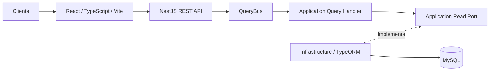
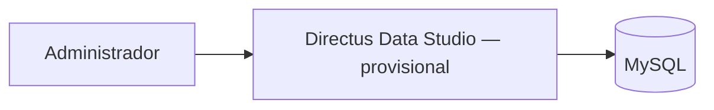
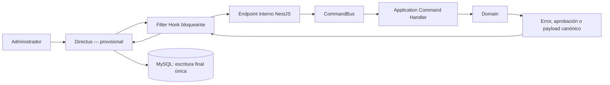
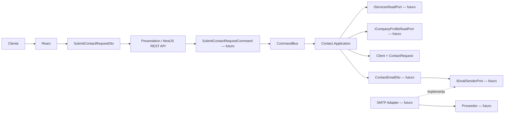

# Cromática Creativa — Sitio web corporativo

Monorepo para el sitio público de Cromática Creativa y su backend modular.


## Arquitectura actual del backend

El backend está implementado sobre Node.js 22, TypeScript y NestJS como monolito modular con DDD pragmático y arquitectura hexagonal. La composición usa Dependency Injection de NestJS; `@nestjs/cqrs` está preparado para futuros Commands, Queries y Handlers reales. TypeORM accede a MySQL desde Infrastructure y sus migrations versionadas son la autoridad estructural.

Directus es un candidato provisional para el backoffice. Su adopción depende de una prueba de concepto sobre el **Hostinger Business Web Hosting existente**. No está desplegado, configurado ni validado en ese entorno, y no se afirma soporte oficial. Si la PoC falla, el CMS se reconsiderará en una ADR futura sin seleccionar anticipadamente una alternativa. La autenticación técnica Directus → NestJS está pendiente en ADR-023 y no se considera resuelta por la PoC.

La aplicación tendrá cuatro Bounded Contexts: `Portfolio`, `Services`, `CompanyProfile` y `Contact`. React consumirá únicamente la API REST de NestJS; nunca Directus ni MySQL.

## Estado físico actual

La fundación backend está migrada y verificada: `backend/` contiene la aplicación NestJS, Domain TypeScript para los cuatro contextos, un único `DataSource` TypeORM/MySQL, diez Persistence Models, cinco mappers y tres migrations separadas por ownership modular.

No existen casos de uso de Application, Commands/Queries concretos, ports con consumidor, controllers ni endpoints. El frontend no está implementado: React + TypeScript + Vite permanece como objetivo de una fase posterior. Directus no está instalado y su PoC sigue pendiente. La implementación .NET/EF/PostgreSQL anterior permanece únicamente en la historia de Git y ADRs históricas.

```text
backend/src/
├── modules/
│   └── {Portfolio|Services|CompanyProfile|Contact}/
│       ├── {Context}.Domain/{Abstract,Aggregates,Entities,ValueObjects,Enums,Exceptions}
│       ├── {Context}.Application/{Ports,Validations,Commands,Queries}
│       ├── {Context}.Infrastructure/{Persistence,Adapters}
│       ├── {Context}.Presentation/
│       │   ├── Controllers/
│       │   ├── Mappers/
│       │   └── DTOs/                 # solo con un contrato de transporte real
│       ├── {Context}.Commons/DTOs
│       └── {Context}Module.ts
├── Infrastructure/{Configuration,Persistence}/
├── AppModule.ts
└── main.ts
```

Las carpetas sin una responsabilidad implementada se conservan con `.gitkeep`; no contienen placeholders funcionales. No existe `shared/domain`, Shared Kernel, Commons global ni una capa global `src/database`. `{Context}.Commons` es local al módulo y no constituye una quinta capa: sus DTOs son contratos planos internos entre adaptadores/mappers del mismo contexto y no representan HTTP. Los Request/Response DTOs de una frontera HTTP pertenecen a `{Context}.Presentation/DTOs` solo cuando existe un contrato de transporte real. Domain no depende de ninguno de los dos. Actualmente `CompanyProfile.Presentation` contiene solo `Controllers` y `Mappers`; `Contact.Presentation` contiene además `DTOs/SubmitContactRequestDto.ts` para la futura frontera HTTP del formulario. `Domain/Abstract` admite solo interfaces con prefijo `I`; las bases locales de Value Objects viven en `Domain/ValueObjects/Base`.

## Actores y alcance V1

- **Cliente**: actor público sin cuenta, registro, login, perfil, roles ni permisos persistidos. Consulta contenido y puede enviar el formulario de contacto.
- `Client`: Entity interna y efímera de `Contact.Domain` que compone los datos validados del remitente. Su `ClientId` no viene del frontend ni se persiste: Application/composition proporcionará el UUID al construirla; no es una cuenta.
- **Administrador**: personal autorizado que administraría contenido mediante el CMS si Directus supera la PoC.
- `CorporateClient`: Aggregate Root de `Portfolio` que representa una empresa o marca; no es el actor Cliente ni una cuenta.

La V1 no incluye comercio electrónico, pagos, cuentas de Cliente, interacción entre Clientes, autenticación propia, roles propios del backend ni panel administrativo en React.

Misión, visión, descripción institucional, eslóganes y textos corporativos poco cambiantes permanecen en código. No se crea `SiteSettings`, un módulo `Site` ni tablas equivalentes sin un requisito real.

## Bounded Contexts y modelo

| Bounded Context | Modelo y responsabilidad |
| --- | --- |
| `Portfolio` | `Project` y `CorporateClient` son Aggregate Roots. `ProjectMedia` es Entity interna de `Project`; `ProjectPeriod` es Value Object; las referencias a servicio/categoría pertenecen a Portfolio. |
| `Services` | `Service` y `ServiceCategory` son Aggregate Roots. Cada categoría pertenece a exactamente un Service y su `ReferenceImage` no equivale a `ProjectMedia`. |
| `CompanyProfile` | `CompanyContactInformation` es Aggregate Root. Administra colecciones de teléfonos y correos públicos, SocialLinks —incluido WhatsApp—, una ubicación opcional y un `ContactRequestRecipientEmail` interno único. `CompanyLocation` es un Value Object compuesto. |
| `Contact` | `ContactRequest` es Aggregate Root y contiene una Entity `Client`, `TipoSolicitud`, `RequestedServiceReference` y mensaje opcional. No se asume persistencia histórica y el Aggregate no envía correo. |

Los contextos se comunicarán solo por contratos mínimos de `public/` cuando exista un consumidor real; actualmente no se inventaron esos contratos. No comparten Entities/Aggregate Roots ni se crean módulos independientes `Projects`, `CorporateClients`, `Categories`, `Location` o `Media`.

## Capas y dependencias

```text
Presentation ─────► Application ─────► Domain
Infrastructure ───► Application
Infrastructure ───► Domain          # solo cuando el mapping real lo requiera
```

- Domain conserva invariantes y no depende de NestJS, TypeORM, MySQL, Directus ni HTTP. `Domain/Abstract` contiene únicamente interfaces reales con prefijo `I`; `ScalarValueObject` es la base local de igualdad por valor y `UuidValueObject` normaliza y valida UUID no vacíos en `ValueObjects/Base`, pero no genera identidades. Los ID siguen siendo Value Objects Domain y reciben su UUID bruto desde Application/composition.
- Application orquesta Domain, declara ports en `Application/Ports` y separa validaciones de caso de uso en `Application/Validations`.
- Presentation adapta HTTP y despacha mediante `CommandBus` o `QueryBus`; los controllers no contienen negocio.
- Infrastructure implementa ports, persistencia y adaptadores técnicos.

El modelo de persistencia no es el modelo de Domain. Los Persistence Models TypeORM viven exclusivamente en Infrastructure y se traducen mediante mappers. No se añaden decoradores TypeORM a Aggregates, Entities o Value Objects de Domain.

## Flujos principales

### Lectura pública



Las Queries son de solo lectura, proyectan DTOs, evitan N+1 y no reconstruyen Aggregates cuando una proyección es suficiente.

### Lectura administrativa



Si la PoC resulta satisfactoria, las lecturas administrativas ordinarias serán directas y no pasarán por NestJS.

### Mutación administrativa



NestJS/TypeORM puede leer estado para procesar el Command, pero no ejecuta el `INSERT`, `UPDATE` o `DELETE` final de esa misma mutación. Directus es el único escritor final después de la aprobación. Esta regla evita la doble escritura.

### Formulario público de contacto



Solo `SubmitContactRequestDto` y la fundación Domain están materializados. El Command, sus tres ports, `ContactEmailDto`, el adaptador SMTP y el endpoint siguen pendientes y no se simulan. Directus no participa y no se presupone tabla para `ContactRequest` o `Client`. El `From` será configuración técnica, el `To` procederá de `CompanyProfile` y el `Reply-To` será el correo validado de `Client`.

## Persistencia objetivo

- MySQL es la base relacional objetivo.
- TypeORM y sus migrations versionadas controlan el esquema; no se usa `synchronize: true` en producción.
- PK, FK internas, nulabilidad, unicidad, checks, índices, cardinalidades y delete behaviors se definen explícitamente cuando se implemente cada modelo.
- Se usa un único `DataSource` técnico en `backend/src/Infrastructure/Persistence/TypeOrmDataSource.ts`. Cada módulo registra solo sus propios Persistence Models mediante `TypeOrmModule.forFeature(...)`.
- Los UUID se almacenan como `CHAR(36)` ASCII/binario por legibilidad, compatibilidad TypeORM/Directus y simplicidad operativa.
- Las tablas usan nombres singulares `snake_case`; no existen schemas PostgreSQL ni FKs entre Bounded Contexts.
- Portfolio, Services y CompanyProfile poseen sus propias carpetas `{Context}.Infrastructure/Persistence/{Models,Mappers,Configurations,Migrations}` y DTOs de persistencia planos en `{Context}.Commons/DTOs`. Contact no posee Persistence Models, tabla ni migration funcional.
- CompanyProfile persiste el destinatario interno directamente en `company_profile.contact_request_recipient_email`. `phone` y `email` contienen filas públicas ordenadas; WhatsApp es una fila de `social_link`, no un tipo de teléfono.
- `location` usa `company_profile_id` como PK/FK y exige address, latitude y longitude. Esta forma relacional no introduce identidad de negocio para `CompanyLocation`.
- La portada única se protege dentro de Portfolio mediante `cover_project_id`, columna generada nullable con índice único: múltiples no-portadas producen `NULL` y solo una portada por Project puede producir su UUID.
- Directus, si supera la PoC, introspeccionará tablas creadas externamente y no será autoridad del Data Model del dominio.

## PoC obligatoria de Directus

La PoC en el **Hostinger Business Web Hosting existente** debe verificar:

1. ejecución de Node.js 22;
2. conexión a MySQL de Hostinger;
3. inicialización de tablas internas de Directus;
4. acceso y funcionamiento de Data Studio;
5. introspección de tablas del dominio creadas externamente;
6. ejecución de Filter Hooks bloqueantes;
7. llamada del Hook a NestJS;
8. aprobación y rechazo de mutaciones;
9. canonicalización del payload;
10. persistencia posterior a la aprobación;
11. ausencia de doble escritura;
12. persistencia y comportamiento de uploads;
13. carga de extensions;
14. supervivencia de uploads y extensions tras reinicio o redeploy.

Hasta completar estas pruebas, Directus es provisional.

## Tecnologías objetivo

| Área | Objetivo | Estado físico |
| --- | --- | --- |
| Frontend | React, TypeScript, Vite, HTML5 y CSS | Objetivo futuro; no implementado |
| Backend | Node.js 22, TypeScript y NestJS REST | Fundación implementada y compilada |
| CQRS | `@nestjs/cqrs`, `CommandBus` y `QueryBus` | Módulo configurado; casos de uso pendientes |
| Persistencia | TypeORM y TypeORM Migrations | 10 Persistence Models, 5 mappers y 3 migrations modulares |
| Datos | MySQL | Configuración validada; migration no aplicada por falta de instancia local |
| CMS | Directus | Provisional; PoC pendiente |
| Arquitectura | Monorepo, monolito modular, DDD pragmático y hexagonal | Decisión objetivo documentada |

No se fijan versiones distintas de Node.js 22 hasta que una implementación real las requiera y verifique.

## Endpoints

Actualmente no hay endpoints implementados ni rutas definidas.

| Método | Endpoint | Módulo | Estado |
| --- | --- | --- | --- |
| — | — | — | No hay endpoints implementados |

El catálogo se mantiene en [docs/ENDPOINTS.md](docs/ENDPOINTS.md).

## Desarrollo local

El backend usa npm y versiona `backend/package-lock.json`. El paquete frontend se creará en una tarea posterior.

```powershell
cd backend
npm ci
npm run typecheck
npm run build
npm test
```

La configuración MySQL usa `MYSQL_HOST`, `MYSQL_PORT`, `MYSQL_DATABASE`, `MYSQL_USER` y `MYSQL_PASSWORD`; `PORT` configura el listener. Consulte `.env.example` y no versione secretos. Los scripts `migration:show`, `migration:run` y `migration:revert` usan el DataSource técnico único y requieren una instancia MySQL configurada; las migrations no se aplicaron a una base real en esta tarea.

## Documentación

- [Arquitectura](docs/ARCHITECTURE.md)
- [Convenciones](docs/CONVENTIONS.md)
- [Decisiones](docs/DECISIONS.md)
- [Desarrollo](docs/DEVELOPMENT.md)
- [Endpoints](docs/ENDPOINTS.md)
- [Roadmap](docs/ROADMAP.md)
- [Guía para agentes](AGENTS.md)
