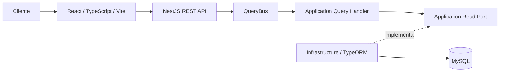
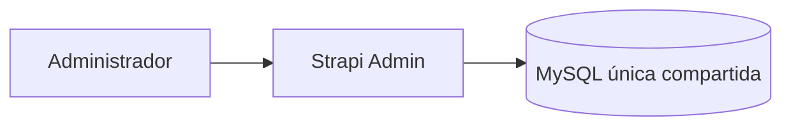
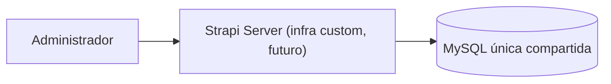
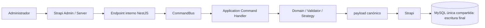
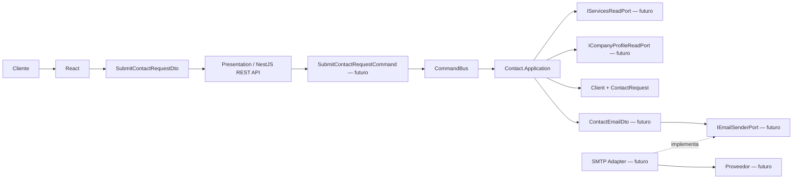
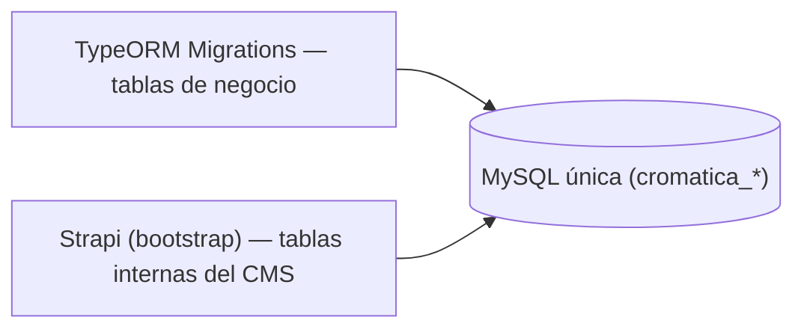

# Cromática Creativa — Sitio web corporativo

Monorepo para el sitio público de Cromática Creativa y su backend modular.


## Arquitectura actual del backend

El backend está implementado sobre Node.js 22, TypeScript y NestJS como monolito modular con DDD pragmático y arquitectura hexagonal. La composición usa Dependency Injection de NestJS; `@nestjs/cqrs` está preparado para futuros Commands, Queries y Handlers reales. TypeORM accede a MySQL desde Infrastructure y sus migrations versionadas son la única autoridad estructural de las tablas de negocio (ADR-027).

**Strapi 5** (TypeScript) es el CMS administrativo, incorporado como aplicación Node independiente en `infrastructure/CMS/Strapi/`, que comparte **una sola base de datos MySQL** con el backend pero gobierna únicamente sus tablas internas (ADR-027). Provee panel administrativo, autenticación de administradores y roles/permisos; **no** es dueño del schema de las tablas de negocio ni las modela como content-types. NestJS conserva las reglas de negocio (CREATE/UPDATE), **TypeORM migrations** son la autoridad estructural de las tablas de negocio y MySQL el enforcement estructural. Su adopción productiva depende de una PoC sobre el **Hostinger Business Web Hosting existente**; no se afirma soporte oficial hasta validarla. La integración administrativa custom Strapi → NestJS (incluida la autenticación service-to-service) se implementará en una fase posterior. Directus fue retirado definitivamente (ADR-025).

La aplicación tendrá cuatro Bounded Contexts: `Portfolio`, `Services`, `CompanyProfile` y `Contact`. React consumirá únicamente la API REST de NestJS; nunca Strapi ni MySQL.

## Estado físico actual

La fundación backend está migrada y verificada: `backend/` contiene la aplicación NestJS, Domain TypeScript para los cuatro contextos, un único `DataSource` TypeORM/MySQL, diez Persistence Models, cinco mappers y tres migrations por módulo **registradas** en el DataSource (`synchronize: false`): las TypeORM migrations son la autoridad estructural de las tablas de negocio (ADR-027).

HU22 "Agregar información de contacto" y HU24 "Agregar ubicación" (más HU23/HU25) materializan los primeros casos de uso reales en CompanyProfile: los Commands `AgregarInformacionDeContacto` y `AgregarUbicacion` con sus Handlers, el puerto de solo lectura `ICompanyProfileStateReader` y una frontera HTTP interna. El cambio del correo receptor reutiliza `AgregarInformacionDeContactoCommand` mediante `AgregarCorreoReceptorStrategy`; no existe un Command paralelo para validar ese campo. Toda esa lógica de negocio permanece intacta tras retirar Directus; su frontera interna (`CompanyProfileCmsController`) **no está registrada** en esta fase, pendiente de la integración con Strapi (autenticación service-to-service y re-registro). NestJS es la autoridad de reglas de negocio; las TypeORM migrations gobiernan el schema de las tablas de negocio; Strapi es el CMS administrativo (auth + sus tablas internas) sobre la base MySQL única compartida y accederá a los datos de negocio mediante infraestructura custom en una fase posterior. El frontend no está implementado: React + TypeScript + Vite permanece como objetivo de una fase posterior. Strapi está incorporado en `infrastructure/CMS/Strapi/`; la PoC de Hostinger sigue pendiente. La implementación .NET/EF/PostgreSQL anterior permanece únicamente en la historia de Git y ADRs históricas.

```text
project-cromaticacreativa-web/
├── backend/                              # aplicación NestJS
│   └── src/
│       ├── modules/
│       │   └── {Portfolio|Services|CompanyProfile|Contact}/
│       │       ├── {Context}.Domain/{Abstract,Aggregates,Entities,ValueObjects,Enums,Exceptions}
│       │       ├── {Context}.Application/{Ports,Validations,Commands,Queries}
│       │       ├── {Context}.Infrastructure/{Persistence,Adapters}
│       │       ├── {Context}.Presentation/{Controllers,Mappers,DTOs}
│       │       ├── {Context}.Commons/DTOs
│       │       └── {Context}Module.ts
│       ├── Infrastructure/{Configuration,Persistence}/ # capa interna NestJS
│       ├── AppModule.ts
│       └── main.ts
├── infrastructure/
│   └── CMS/
│       └── Strapi/                       # CMS Strapi 5 (aplicación Node independiente; base MySQL compartida)
│           ├── package.json
│           ├── package-lock.json
│           ├── tsconfig.json
│           ├── .env.example
│           ├── README.md
│           ├── config/                   # server, admin, database (STRAPI_DB_*), plugins, middlewares
│           ├── src/
│           ├── database/
│           └── public/
├── docs/
└── README.md
```

`backend/src/Infrastructure/` es la capa técnica interna de NestJS. `infrastructure/CMS/Strapi/` es otra aplicación y proceso Node, con sus propias dependencias, variables, base de datos y deployment; no es un Bounded Context ni participa en el build TypeScript del backend.

Las carpetas sin una responsabilidad implementada se conservan con `.gitkeep`; no contienen placeholders funcionales. No existe `shared/domain`, Shared Kernel, Commons global ni una capa global `src/database`. `{Context}.Commons` es local al módulo y no constituye una quinta capa: sus DTOs son contratos planos internos entre adaptadores/mappers del mismo contexto y no representan HTTP. Los Request/Response DTOs de una frontera HTTP pertenecen a `{Context}.Presentation/DTOs` solo cuando existe un contrato de transporte real. Domain no depende de ninguno de los dos. Actualmente `CompanyProfile.Presentation` contiene `Controllers`, `Mappers` y DTOs de sus fronteras HTTP; `Contact.Presentation` contiene `DTOs/SubmitContactRequestDto.ts` para la futura frontera HTTP del formulario. `Domain/Abstract` admite solo interfaces con prefijo `I`; las bases locales de Value Objects viven en `Domain/ValueObjects/Base`.

## Actores y alcance V1

- **Cliente**: actor público sin cuenta, registro, login, perfil, roles ni permisos persistidos. Consulta contenido y puede enviar el formulario de contacto.
- `Client`: Entity interna y efímera de `Contact.Domain` que compone los datos validados del remitente. Su `ClientId` no viene del frontend ni se persiste: Application/composition proporcionará el UUID al construirla; no es una cuenta.
- **Administrador**: personal autorizado con una cuenta previamente configurada en Strapi. Su autenticación nativa pertenece al CMS y no a NestJS o React.
- `CorporateClient`: Aggregate Root de `Portfolio` que representa una empresa o marca; no es el actor Cliente ni una cuenta.

La V1 no incluye comercio electrónico, pagos, cuentas de Cliente, interacción entre Clientes, autenticación propia, roles propios del backend ni panel administrativo en React.

Misión, visión, descripción institucional, eslóganes y textos corporativos poco cambiantes permanecen en código. No se crea `SiteSettings`, un módulo `Site` ni tablas equivalentes sin un requisito real.

## Bounded Contexts y modelo

| Bounded Context | Modelo y responsabilidad |
| --- | --- |
| `Portfolio` | `Project` y `CorporateClient` son Aggregate Roots. `ProjectMedia` es Entity interna de `Project`; `ProjectPeriod` es Value Object; las referencias a servicio/categoría pertenecen a Portfolio. |
| `Services` | `Service` y `ServiceCategory` son Aggregate Roots. Cada categoría pertenece a exactamente un Service y su `ReferenceImage` no equivale a `ProjectMedia`. |
| `CompanyProfile` | `CompanyContactInformation` es Aggregate Root. Administra colecciones de teléfonos y correos públicos, SocialLinks —incluido WhatsApp—, una ubicación opcional y un `ContactRequestRecipientEmail` interno único. `CompanyLocation` es un Value Object compuesto. |
| `Contact` | `ContactRequest` es Aggregate Root y contiene una Entity `Client`, `TipoSolicitud`, `RequestedServiceReference` y mensaje opcional. No se asume persistencia histórica y el Aggregate no envía correo. |

Los contextos se comunicarán solo por contratos mínimos de `public/` cuando exista un consumidor real; actualmente no se inventaron esos contratos. No comparten Entities/Aggregate Roots ni se crean módulos independientes `Projects`, `CorporateClients`, `Categories`, `Location` o `Media`.

## Capas y dependencias

```text
Presentation ─────► Application ─────► Domain
Infrastructure ───► Application
Infrastructure ───► Domain          # solo cuando el mapping real lo requiera
```

- Domain conserva invariantes y no depende de NestJS, TypeORM, MySQL, el CMS (Strapi) ni HTTP. `Domain/Abstract` contiene únicamente interfaces reales con prefijo `I`; `ScalarValueObject` es la base local de igualdad por valor y `UuidValueObject` normaliza y valida UUID no vacíos en `ValueObjects/Base`, pero no genera identidades. Los ID siguen siendo Value Objects Domain y reciben su UUID bruto desde Application/composition.
- Application orquesta Domain, declara ports en `Application/Ports` y separa validaciones de caso de uso en `Application/Validations`.
- Presentation adapta HTTP y despacha mediante `CommandBus` o `QueryBus`; los controllers no contienen negocio.
- Infrastructure implementa ports, persistencia y adaptadores técnicos.

El modelo de persistencia no es el modelo de Domain. Los Persistence Models TypeORM viven exclusivamente en Infrastructure y se traducen mediante mappers. No se añaden decoradores TypeORM a Aggregates, Entities o Value Objects de Domain.

## Flujos principales

### Lectura pública



Las Queries son de solo lectura, proyectan DTOs, evitan N+1 y no reconstruyen Aggregates cuando una proyección es suficiente.

### Autenticación administrativa



Las cuentas, sesiones, roles y permisos administrativos viven en Strapi, en la
misma base MySQL compartida. NestJS no ofrece login administrativo.

### Lectura y eliminación administrativas (GET / DELETE) — objetivo, pendiente



En el flujo objetivo, las lecturas (GET) y eliminaciones (DELETE) de los datos de
negocio las resolverá Strapi directamente contra MySQL mediante su **futura
infraestructura custom**. No pasan por NestJS: NestJS no se convierte en CRUD para
satisfacer al CMS. TypeORM migrations siguen gobernando la estructura de esas tablas.

### CREATE / UPDATE con reglas de negocio (objetivo, pendiente)



Los CREATE/UPDATE que requieren negocio pasan por NestJS, que valida y canonicaliza,
y devuelve el payload canónico a Strapi, que ejecuta la escritura final (mismo flujo
conceptual que se tenía con Directus, ahora con Strapi). NestJS es la autoridad de
reglas de negocio; no es el escritor administrativo final. La integración custom
Strapi → NestJS, su autenticación service-to-service y los lifecycles se implementan
en una fase posterior (ADR-027); en esta fase no están implementados.

### Formulario público de contacto



Solo `SubmitContactRequestDto` y la fundación Domain están materializados. El Command, sus tres ports, `ContactEmailDto`, el adaptador SMTP y el endpoint siguen pendientes y no se simulan. El CMS (Strapi) no participa y no se presupone tabla para `ContactRequest` o `Client`. El `From` será configuración técnica, el `To` procederá de `CompanyProfile` y el `Reply-To` será el correo validado de `Client`.

## Persistencia objetivo

- MySQL es la base relacional objetivo.
- TypeORM y sus migrations versionadas controlan el esquema; no se usa `synchronize: true` en producción.
- PK, FK internas, nulabilidad, unicidad, checks, índices, cardinalidades y delete behaviors se definen explícitamente cuando se implemente cada modelo.
- Se usa un único `DataSource` técnico en `backend/src/Infrastructure/Persistence/TypeOrmDataSource.ts`. Cada módulo registra solo sus propios Persistence Models mediante `TypeOrmModule.forFeature(...)`.
- Los UUID se almacenan como `CHAR(36)` ASCII/binario por legibilidad, compatibilidad con TypeORM y un CMS, y simplicidad operativa.
- Las tablas usan nombres singulares `snake_case`; no existen schemas PostgreSQL ni FKs entre Bounded Contexts.
- Portfolio, Services y CompanyProfile poseen sus propias carpetas `{Context}.Infrastructure/Persistence/{Models,Mappers,Configurations,Migrations}` y DTOs de persistencia planos en `{Context}.Commons/DTOs`. Contact no posee Persistence Models, tabla ni migration funcional.
- CompanyProfile persiste el destinatario interno directamente en `company_profile.contact_request_recipient_email`. `phone` y `email` contienen filas públicas ordenadas; WhatsApp es una fila de `social_link`, no un tipo de teléfono.
- `location` usa `company_profile_id` como PK/FK y exige address, latitude y longitude. Esta forma relacional no introduce identidad de negocio para `CompanyLocation`.
- La portada única se protege dentro de Portfolio mediante `cover_marker = CASE WHEN is_cover = 1 THEN 1 ELSE NULL END`, columna generada nullable independiente de `project_id`, y `UNIQUE (project_id, cover_marker)`: múltiples no-portadas producen `NULL` y solo una portada por Project puede producir el marcador `1`.
- **TypeORM Migrations es la única autoridad estructural** de las diez tablas de negocio (crea y evoluciona su schema; `synchronize: false`). Strapi comparte la **misma** base MySQL pero gobierna solo sus tablas internas; no crea ni altera las tablas de negocio (ADR-027).



El login administrativo es `Administrador → Strapi Admin → autenticación local de Strapi → sesión de Strapi`; NestJS no interviene, el registro público permanece deshabilitado y el futuro React no implementa login administrativo.

## PoC obligatoria de Strapi

La PoC en el **Hostinger Business Web Hosting existente** debe verificar:

1. ejecución de Node.js 22 como aplicación Node administrada;
2. conexión a la base MySQL/MariaDB única compartida con el backend;
3. inicialización de las tablas internas de Strapi (bootstrap), sin tocar las tablas de negocio;
4. acceso y funcionamiento del panel de administración;
5. autenticación de administradores y roles/permisos;
6. `npm run build` y arranque (`npm run start`) en el entorno;
7. persistencia y comportamiento de uploads;
8. supervivencia de uploads y configuración tras reinicio o redeploy;
9. (fase posterior) integración administrativa custom Strapi → NestJS y su autenticación service-to-service.

Hasta completar estas pruebas, Strapi es provisional y no está validado para producción.

## Tecnologías objetivo

| Área | Objetivo | Estado físico |
| --- | --- | --- |
| Frontend | React, TypeScript, Vite, HTML5 y CSS | Objetivo futuro; no implementado |
| Backend | Node.js 22, TypeScript y NestJS REST | Fundación implementada y compilada |
| CQRS | `@nestjs/cqrs`, `CommandBus` y `QueryBus` | Módulo configurado; casos de uso pendientes |
| Persistencia | TypeORM y TypeORM Migrations | 10 Persistence Models, 5 mappers y 3 migrations modulares registradas (autoridad estructural del negocio) |
| Datos | MySQL (base única compartida) | TypeORM migrations gobiernan las tablas de negocio; Strapi solo sus tablas internas; MySQL aplica constraints |
| CMS | Strapi 5 (TypeScript) sobre Node.js 22, MySQL/MariaDB, base única compartida | Compila (`npm run build`); PoC Hostinger e integración custom con NestJS pendientes |
| Arquitectura | Monorepo, monolito modular, DDD pragmático y hexagonal | Decisión objetivo documentada |

No se fijan versiones distintas de Node.js 22 hasta que una implementación real las requiera y verifique.

## Endpoints

No hay endpoints públicos ni rutas activas. La lógica de HU22–HU25 vive en la frontera HTTP interna `CompanyProfileCmsController` (`/internal/cms/company-profile/*`), pero tras retirar Directus **no está registrada** en `CompanyProfileModule`: la autenticación service-to-service (CMS → NestJS) y su re-registro se implementarán junto con la integración de Strapi. Ninguna capa Domain/Application queda acoplada al CMS.

| Método | Endpoint (frontera interna) | Módulo | Estado |
| --- | --- | --- | --- |
| POST | `/internal/cms/company-profile/contact-information` | CompanyProfile | Lógica lista (HU22); no registrado |
| POST | `/internal/cms/company-profile/location` | CompanyProfile | Lógica lista (HU24); no registrado |
| POST | `/internal/cms/company-profile/contact-request-recipient-email` | CompanyProfile | Lógica lista (`AgregarInformacionDeContactoCommand` + Strategy); no registrado |
| POST | `/internal/cms/company-profile/contact-information/modify` | CompanyProfile | Lógica lista (HU23); no registrado |
| POST | `/internal/cms/company-profile/location/modify` | CompanyProfile | Lógica lista (HU25); no registrado |

El catálogo completo se mantiene en [docs/ENDPOINTS.md](docs/ENDPOINTS.md).

## Desarrollo local

El backend y Strapi usan paquetes npm independientes y versionan sus propios lockfiles. El paquete frontend se creará en una tarea posterior.

```powershell
cd backend
npm ci
npm run typecheck
npm run build
npm test
```

La configuración MySQL usa `MYSQL_HOST`, `MYSQL_PORT`, `MYSQL_DATABASE`, `MYSQL_USER` y `MYSQL_PASSWORD`; `PORT` configura el listener. Consulte `.env.example` y no versione secretos. Los scripts `migration:show`, `migration:run` y `migration:revert` usan el DataSource técnico único (con las tres migrations registradas) y requieren una instancia MySQL; las migrations no se aplicaron a una base real en esta tarea.

El CMS (Strapi) es un proceso Node independiente que usa la **misma base de datos MySQL** del backend:

```powershell
cd infrastructure/CMS/Strapi
Copy-Item .env.example .env
# Reemplace placeholders y configure STRAPI_DB_* apuntando a la MISMA base MySQL del backend.
npm install
npm run build     # compila el panel; no requiere base de datos
npm run develop   # requiere la base compartida; crea el primer administrador
```

El panel queda en `http://localhost:1337/admin`. El primer Administrador se crea en el primer arranque de `develop`. Los secretos (`APP_KEYS`, `ADMIN_JWT_SECRET`, `API_TOKEN_SALT`, `TRANSFER_TOKEN_SALT`, `JWT_SECRET`, `ENCRYPTION_KEY`) y las credenciales `STRAPI_DB_*` nunca se versionan. El registro público está deshabilitado por defecto y no debe activarse. La guía reproducible y el despliegue en Hostinger están en [`infrastructure/CMS/Strapi/README.md`](infrastructure/CMS/Strapi/README.md).

## Documentación

- [Arquitectura](docs/ARCHITECTURE.md)
- [Convenciones](docs/CONVENTIONS.md)
- [Decisiones](docs/DECISIONS.md)
- [Desarrollo](docs/DEVELOPMENT.md)
- [Endpoints](docs/ENDPOINTS.md)
- [Roadmap](docs/ROADMAP.md)
- [Guía para agentes](AGENTS.md)
