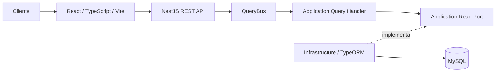
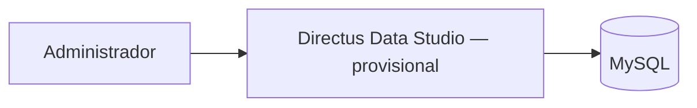
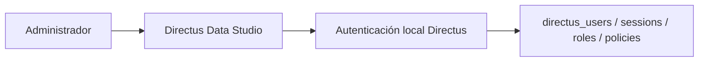
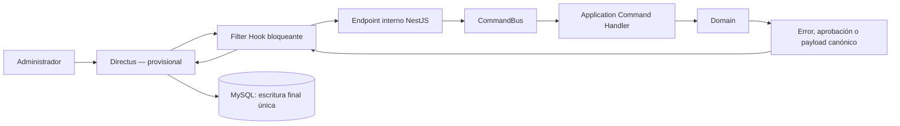
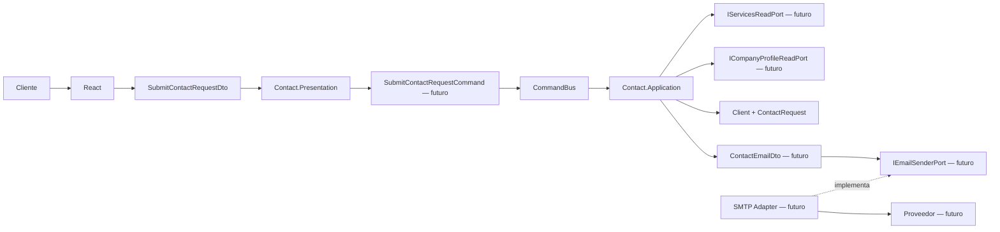
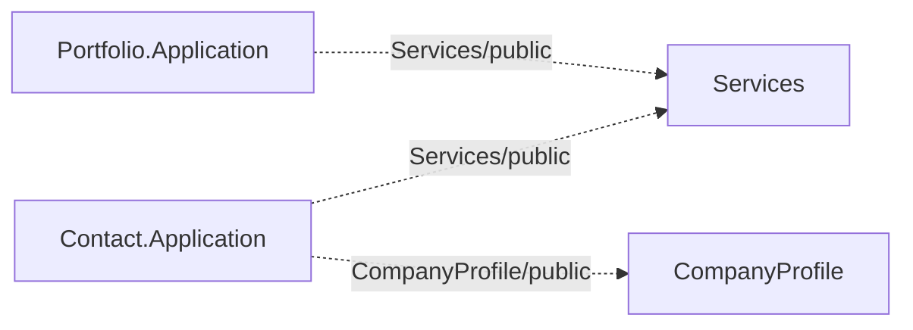
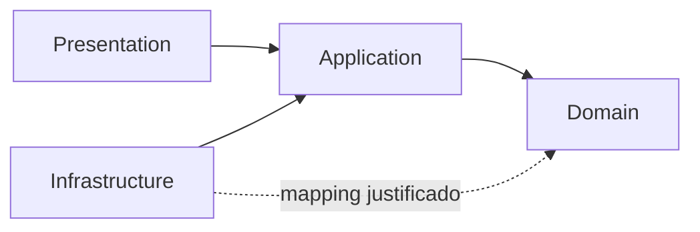
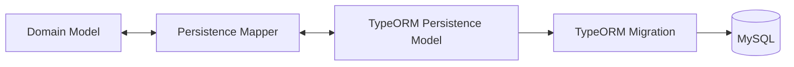
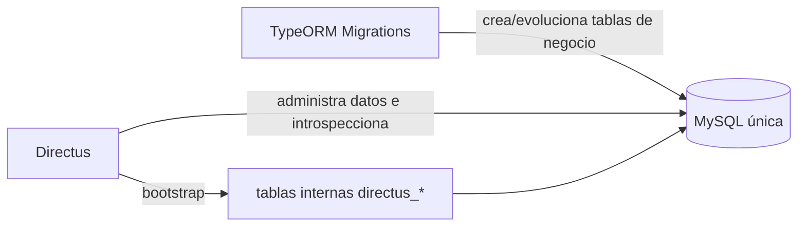

# Arquitectura

Este documento es la fuente de verdad de la arquitectura vigente de Cromática Creativa.

## Estado implementado

- Frontend público: objetivo futuro React, TypeScript, Vite, HTML5 y CSS; no implementado.
- Backend: Node.js 22, TypeScript y NestJS REST.
- Estilo: monorepo, monolito modular, DDD pragmático y arquitectura hexagonal.
- CQRS in-process: `@nestjs/cqrs`, `CommandBus`, `QueryBus`, Command Handlers y Query Handlers.
- Persistencia: TypeORM sobre MySQL, con TypeORM Migrations como autoridad estructural.
- CMS candidato: Directus `12.3.0` incorporado/configurado localmente para HU09 y provisional hasta superar la PoC en el **Hostinger Business Web Hosting existente**.

La fundación anterior fue reemplazada y retirada del árbol activo. El backend NestJS, Domain TypeScript, `@nestjs/cqrs`, TypeORM/MySQL, diez Persistence Models, cinco mappers, tres migrations modulares y tests están implementados. HU22 "Agregar información de contacto" y HU24 "Agregar ubicación" añaden los primeros casos de uso reales en CompanyProfile (Commands/Handlers, puerto de solo lectura reutilizado, controller interno con dos endpoints y Filter Hook de Directus); fuera de HU22/HU24 no existen otros Commands/Queries, controllers o endpoints, ni frontend, y HU23/HU25/eliminación siguen pendientes. Directus existe como aplicación Node independiente; su ejecución contra MySQL se verifica solo cuando hay una instancia y credenciales reales disponibles.

## Estructura física

```text
project-cromaticacreativa-web/
├── backend/                              # aplicación NestJS
│   └── src/
│       ├── modules/
│       │   └── {Context}/
│       │       ├── {Context}.Domain/
│       │       ├── {Context}.Application/
│       │       ├── {Context}.Infrastructure/
│       │       ├── {Context}.Presentation/
│       │       ├── {Context}.Commons/
│       │       └── {Context}Module.ts
│       ├── Infrastructure/               # capa técnica interna de NestJS
│       │   ├── Configuration/DatabaseConfiguration.ts
│       │   └── Persistence/TypeOrmDataSource.ts
│       ├── AppModule.ts
│       └── main.ts
└── infrastructure/                       # infraestructura externa del sistema
    └── CMS/
        └── Directus/                     # proceso Node independiente
            ├── package.json
            ├── package-lock.json
            ├── .env.example
            ├── README.md
            ├── extensions/
            └── uploads/
```

Las dos rutas llamadas Infrastructure tienen alcances distintos: `backend/src/Infrastructure/` pertenece a la arquitectura hexagonal interna de NestJS; `infrastructure/CMS/Directus/` contiene una aplicación externa completa, con proceso, dependencias, configuración y deployment propios. Directus no adopta las capas Domain/Application/Infrastructure/Presentation ni la nomenclatura de Bounded Context.

Las carpetas aún sin código real contienen únicamente `.gitkeep`; no se crean ceremonialmente. `Domain/Abstract` contiene solo interfaces con prefijo `I`; las bases locales de igualdad y validación UUID están en `Domain/ValueObjects/Base`. `Application/Ports` y `Application/Validations` permanecen vacías hasta el primer caso de uso. Cada `{Context}.Commons/DTOs` es local y aloja contratos planos internos compartidos por adaptadores/mappers del contexto; no representa HTTP ni es una capa hexagonal adicional. Los DTOs de transporte HTTP viven en Presentation únicamente cuando existe una frontera real. Domain no depende de ninguno. Actualmente `CompanyProfile.Presentation` contiene `Controllers` y `Mappers`; `Contact.Presentation` contiene esas carpetas y `DTOs/SubmitContactRequestDto.ts`. No existen Shared Kernel, Commons global, `src/database` ni una capa global propietaria del modelo persistente.

```text
CompanyProfile.Presentation/       Contact.Presentation/
├── Controllers/                   ├── Controllers/
└── Mappers/                       ├── DTOs/
                                  │   └── SubmitContactRequestDto.ts
                                  └── Mappers/
```

## Actores y alcance

- **Cliente**: actor público sin cuenta, autenticación, perfil, roles o permisos persistidos. Consulta el sitio y envía el formulario.
- **Administrador**: personal autorizado con una cuenta previamente configurada en Directus; no es una identidad de Domain, NestJS o React.
- `Client`: Entity interna y efímera de Contact que representa los datos validados de una solicitud; su `ClientId` no viene del frontend ni se persiste, y Application/composition proporcionará su UUID al construirla.
- `CorporateClient`: empresa o marca del portafolio; no es el actor Cliente.

La V1 excluye cuentas de Cliente, login, roles propios, panel administrativo React, comercio electrónico y pagos. Los textos institucionales poco cambiantes permanecen en código.

## Vista de alto nivel

### Lectura pública



Las Queries son de solo lectura, no producen efectos, seleccionan únicamente datos públicos y proyectan DTOs. No reconstruyen un Aggregate cuando una proyección basta y deben evitar N+1.

### Lectura administrativa



Directus se configura para que sus lecturas administrativas ordinarias sean directas a MySQL y no pasen por NestJS. La autorización productiva de este diseño continúa condicionada a la PoC.

### Autenticación administrativa — HU09



El primer Administrador se aprovisiona durante `directus bootstrap` mediante `ADMIN_EMAIL` y `ADMIN_PASSWORD`. El login válido crea una sesión nativa de Directus; correos inexistentes y contraseñas incorrectas son rechazados por Directus. NestJS no ofrece endpoint, JWT, usuario, rol o sesión administrativa, y React no ofrece login o registro administrativo. El registro público de Directus permanece deshabilitado por defecto.

### Mutación administrativa



El Filter Hook se ejecuta antes de persistir y espera el resultado. NestJS/TypeORM puede leer el estado necesario para reconstruir o evaluar Domain, pero el Command no ejecuta el `INSERT`, `UPDATE` o `DELETE` final de esa misma mutación. Directus cancela una operación rechazada o persiste el payload canónico aprobado. Esta regla de escritor final único prohíbe la doble escritura.

### Formulario público de contacto



El diagrama completo es objetivo, no estado actual. Solo están materializados `SubmitContactRequestDto`, `Client`, `ContactRequest`, `TipoSolicitud` y sus Value Objects; Command, ports, contratos `public/`, `ContactEmailDto`, adapter y endpoint siguen pendientes. Directus no participa. `Client` y `ContactRequest` no presuponen persistencia histórica. El futuro `From` será configuración técnica, el `To` vendrá de CompanyProfile y el `Reply-To` será el correo validado de `Client`.

## Monolito modular y Bounded Contexts

Los cuatro Bounded Contexts son definitivos para esta fase:

| Contexto | Ownership |
| --- | --- |
| `Portfolio` | Trabajo realizado, Projects, multimedia real y CorporateClients. |
| `Services` | Oferta comercial y categorías de servicio. |
| `CompanyProfile` | Datos públicos administrables, ubicación, redes y destinatario del formulario. |
| `Contact` | Procesamiento del formulario público. |

Compartir proceso o base no permite compartir Entities/Aggregates o consultar tablas de otro contexto. Las interacciones futuras atravesarán contratos mínimos de `public/` con consumidores reales; aún no se han materializado. No existen contextos independientes `Projects`, `CorporateClients`, `Categories`, `Location` o `Media`.



## Modelo de dominio preservado

### Portfolio

- `Project` y `CorporateClient` son Aggregate Roots.
- `ProjectMedia` es Entity interna de `Project`; su colección se modifica mediante el Root.
- `Project` conserva como máximo una referencia a un CorporateClient principal.
- `ProjectPeriod` contiene `StartDate`, `EndDate` y `TotalDays` derivado, y protege `EndDate >= StartDate`.
- `PublicationStatus` (`Draft`/`Published`) expresa publicación y no se reutiliza para estados comerciales.
- `ProjectServiceReference` y `ProjectCategoryReference` son Value Objects propios; Portfolio.Domain no depende de Services.Domain.
- Portfolio.Application valida existencia, pertenencia y estado mediante `Services/public/`.

### Services

- `Service` y `ServiceCategory` son Aggregate Roots.
- Cada ServiceCategory pertenece exactamente a un Service y tiene ciclo de vida propio.
- `ServiceStatus` y `ServiceCategoryStatus` usan `Active`/`Inactive`.
- Solo se exponen Services Active y categorías Active cuyo Service padre esté Active.
- `ReferenceImage` es ilustrativa del tipo de trabajo; no representa un Project ni equivale a `ProjectMedia`.
- El efecto de desactivar Service/ServiceCategory sobre Projects históricos permanece abierto.

### CompanyProfile

- `CompanyContactInformation` es Aggregate Root.
- `phones` y `emails` son colecciones readonly de Value Objects públicos, sin duplicados por valor.
- `SocialLink` es Value Object inmutable compuesto por red y URL; la red es única dentro del Aggregate. WhatsApp se representa aquí, no como teléfono especial.
- `CompanyLocation` es un Value Object compuesto por `Address` y `GeoCoordinates` obligatorias. La ubicación completa es opcional y puede reemplazarse; no posee identidad Domain.
- `ContactRequestRecipientEmail` es exactamente un correo operativo interno y no forma parte automáticamente de `emails`.
- El destinatario es interno al monolito, distinto del correo público y del `From` técnico.

### Contact

- `Client` es Entity interna, no una cuenta: posee `ClientId` generado internamente, `PersonName`, empresa opcional normalizada, `EmailAddress` y `PhoneNumber`.
- `ContactRequest` es Aggregate Root y compone `Client`, `TipoSolicitud`, `requestedService` y mensaje opcional normalizado.
- `TipoSolicitud` usa exclusivamente `SOLICITUD_INFORMACION` y `SOLICITUD_SERVICIO`.
- La identidad de `Client` no procede del frontend ni de MySQL. La condición de Root de la solicitud no implica tabla o historial para ninguno.
- Domain no envía correo ni conoce proveedores.
- Contact.Application validará Services, obtendrá el destinatario desde CompanyProfile y coordinará correo cuando se implemente el caso de uso; sus ports no se crean anticipadamente.

## Arquitectura hexagonal



### Domain

Contiene lenguaje, invariantes y comportamiento. No depende de NestJS, `@nestjs/cqrs`, TypeORM, MySQL, Directus, HTTP, correo, storage ni `node:crypto`. No recibe decoradores técnicos. Sus mensajes de negocio se escriben en español y sus Value Objects preservan igualdad por valor mediante abstracciones locales, no compartidas entre contextos. `UuidValueObject` recibe, normaliza y valida UUID no vacíos; la generación del valor corresponde a Application/composition y no a Domain.

### Application

Orquesta Domain, declara capacidades externas en `Ports` y separa validaciones de caso de uso en `Validations`. Usa Commands para acciones y Queries para lecturas sin efectos. No conoce TypeORM ni adaptadores concretos. Estas carpetas no contienen artefactos funcionales hasta que exista un caso real.

### Presentation

Los controllers traducen HTTP, mapean Request/Response DTOs de `{Context}.Presentation/DTOs` y delegan a `CommandBus` o `QueryBus`. No contienen reglas de negocio ni acceden a repositorios/TypeORM. Esos contratos HTTP son distintos de los DTOs internos de `{Context}.Commons/DTOs`, usados entre adaptadores/mappers; Domain no depende de ninguno.

### Infrastructure

Implementa persistencia, mappers y adaptadores. Puede depender de Application y, cuando un mapping real lo exige, del Domain de su propio contexto. No contiene reglas de negocio.

## CQRS con `@nestjs/cqrs`

```text
HTTP → Controller → CommandBus / QueryBus → Handler → Domain / Application Port
                                                        ↑
                                           Infrastructure implementa
```

- `CommandHandler` procesa una intención o efecto autorizado.
- `QueryHandler` produce una proyección de solo lectura.
- No se crean Commands/Queries artificiales ni CRUD ceremonial.
- CQRS no implica Event Sourcing; Event Sourcing no forma parte de la arquitectura.
- Domain Events solo representan hechos relevantes y los Integration Events requieren consumidor real.
- Cuando un Command tiene variantes extensibles por tipo, el Handler puede resolver una colección de estrategias inyectadas (patrón Strategy) para permanecer como orquestador y respetar OCP. No es una obligación global. Ejemplo vigente: `AgregarInformacionDeContactoCommandHandler → colección de Strategies → Strategy por tipo → Aggregate`.

## Persistencia TypeORM/MySQL



El modelo relacional y el de Domain son deliberadamente distintos. Las clases con decoradores TypeORM viven solo en Infrastructure; no se mapean directamente Aggregate Roots, Entities o Value Objects de Domain.

TypeORM Migrations crea y evoluciona el esquema. `synchronize: true` está prohibido en producción. Cada cambio persistente debe definir y revisar PK, FK internas justificadas, `NOT NULL`, `UNIQUE`, checks compatibles, índices, cardinalidades y delete behaviors.

La aplicación usa un único `DataSource` técnico en `src/Infrastructure/Persistence/TypeOrmDataSource.ts` y una única base MySQL. La configuración global ensambla los modelos y migrations que cada módulo exporta desde su propia configuración. El ownership permanece en cada módulo mediante sus Persistence Models y `TypeOrmModule.forFeature(...)`; ningún módulo consume modelos internos de otro. Las tablas son singulares `snake_case` y los constraints usan prefijos `pk_`, `fk_`, `uq_`, `ck_` e `ix_`.

Directus abre una conexión independiente porque es otro proceso Node, pero `DB_HOST`, `DB_PORT` y `DB_DATABASE` deben coincidir con `MYSQL_HOST`, `MYSQL_PORT` y `MYSQL_DATABASE`. Esto mantiene una sola base física:



TypeORM Migrations es la autoridad sobre `corporate_client`, `project`, `media`, `service`, `category`, `company_profile`, `phone`, `email`, `location` y `social_link`. El bootstrap oficial es la autoridad sobre `directus_*`. Agregar o cambiar una columna de negocio exige una migration TypeORM; hacerlo desde Directus Data Model está prohibido.

Los UUID persistidos se almacenan como `CHAR(36) CHARACTER SET ascii COLLATE ascii_bin`: la representación es legible, uniforme, soportada por TypeORM y fácil de introspeccionar por un CMS futuro. `ClientId` es solo identidad efímera de Domain y no tiene columna. `CalendarDate` mapea directamente a `DATE` como `YYYY-MM-DD`, sin hora ni conversión por zona.

Las migrations se dividen por ownership: Portfolio crea `corporate_client`, `project` y `media`; Services crea `service` y `category`; CompanyProfile crea `company_profile`, `phone`, `email`, `location` y `social_link`. En CompanyProfile, el destinatario interno vive en la raíz, phone/email son colecciones públicas ordenadas con FK hija, WhatsApp vive en social_link y location usa `company_profile_id` como PK/FK. Contact no contiene migration ni tabla funcional. Separarlas no crea conexiones adicionales.

La portada única pertenece a Portfolio y usa la columna generada nullable `media.cover_marker = CASE WHEN is_cover = 1 THEN 1 ELSE NULL END` con `UNIQUE (project_id, cover_marker)`. Como la expresión no depende de `project_id`, MySQL 8.4 permite conservar `fk_media_project` con `ON DELETE CASCADE`; sus múltiples `NULL` permiten N medias no-cover y la combinación `(project_id, 1)` limita cada Project a una sola cover.

No existen schemas PostgreSQL, FKs cruzadas o dependencias Infrastructure → Infrastructure. Los modelos implementan DTOs de persistencia planos de su `{Context}.Commons` y los mappers reciben esos contratos sin convertirlos en modelos Domain. `Client` y `ContactRequest` continúan sin persistencia histórica aprobada. Los límites transaccionales futuros permanecen abiertos.

## Directus provisional y PoC

Directus está incorporado y configurado localmente para HU09, pero todavía no es una capacidad adoptada para producción. La PoC debe realizarse en el **Hostinger Business Web Hosting existente**. No se afirma que Directus esté desplegado, funcione allí o sea oficialmente soportado para esta topología.

HU09 cubre instalación Node, configuración de una misma MySQL, bootstrap, Administrador inicial, login nativo, rechazo de credenciales inválidas, registro público deshabilitado e introspección básica. HU22 añade el primer Filter Hook bloqueante (`phone`/`email`/`social_link` create), el endpoint interno NestJS `/internal/cms/company-profile/contact-information`, el primer Command administrativo y la autenticación técnica por token (ADR-023). HU24 amplía la misma extensión y controller con `location` create y el endpoint `/internal/cms/company-profile/location`. Permanecen abiertos los permisos CRUD finos, HU23/HU25, la eliminación y el deployment. Las comprobaciones locales dependientes de MySQL se marcan según evidencia real en `ROADMAP.md`.

La PoC debe verificar:

1. ejecución de Node.js 22;
2. conexión a MySQL de Hostinger;
3. inicialización de tablas internas de Directus;
4. funcionamiento de Data Studio;
5. introspección de tablas del dominio creadas externamente;
6. Filter Hooks bloqueantes;
7. llamada Hook → NestJS;
8. aprobación y rechazo;
9. canonicalización del payload;
10. persistencia después de aprobación;
11. ausencia de doble escritura;
12. persistencia y comportamiento de uploads;
13. carga de extensions;
14. supervivencia de uploads/extensions tras reinicio o redeploy.

Si falla, se reconsiderará el CMS mediante una ADR futura; esta arquitectura no selecciona una alternativa. La autenticación técnica Directus → NestJS quedó resuelta en ADR-023 (token `Bearer` dedicado por ambiente); permisos CRUD finos, almacenamiento y operación continúan abiertos.

## Frontend React/Vite — fase futura

El frontend no está implementado. React + TypeScript + Vite será el único cliente web público cuando se materialice en una tarea posterior. Usará HTML semántico, CSS responsive y acceso HTTP centralizado en services/API clients. `app`, `pages`, `features`, `components`, `hooks`, `services`, `types`, `utils` y `assets` se materializarán solo con responsabilidades reales; no se replica la arquitectura hexagonal del backend.

```text
Page / Component → Feature / Hook → Service / API client → NestJS REST
```

React nunca consume Directus o MySQL, no conoce endpoints internos, credenciales o destinatarios y no envía correo directamente. Sus tipos representan contratos HTTP o necesidades de UI, no clases de Domain.

## DTOs, validación y errores

```text
Request DTO → Command / Query → Handler → Domain
Projection / Domain → Response DTO → HTTP → TypeScript type
```

- React y Directus aportan UX.
- Presentation protege y traduce la frontera HTTP.
- Application valida entrada, existencia, precondiciones y coherencia.
- Domain protege invariantes.
- MySQL aplica integridad estructural.
- Infrastructure traduce fallos técnicos; Presentation no filtra stack traces, SQL, secretos o detalles del proveedor.
- Un Presentation DTO representa transporte HTTP —por ejemplo `SubmitContactRequestDto` o un futuro `GetProjectsResponseDto`—. Un Commons DTO representa un contrato plano interno de adaptador/persistencia —por ejemplo `ProjectPersistenceDto` o `CompanyProfilePersistenceDto`— y no es HTTP.

## Seguridad y rendimiento

- Cliente sin autenticación; no puede mutar contenido administrado.
- Administrador usa el CMS provisional; no se crea autenticación NestJS propia para personas en V1.
- Directus → NestJS se autentica con un token técnico `Bearer` dedicado (`CMS_INTERNAL_TOKEN`), comparado con tiempo constante y con diseño fail closed (ADR-023).
- MySQL y secretos no se exponen al Cliente ni se versionan.
- Lecturas proyectadas, cancelación cuando aplique, prevención de N+1 y paginación solo con necesidad real.
- Caching, observabilidad y optimización se incorporan con métricas y requisitos.

## Decisiones vigentes y abiertas

Vigentes: monolito modular, arquitectura hexagonal física por contexto, ownership modular de persistencia/migrations, un DataSource técnico, ausencia de Shared Kernel, cuatro Bounded Contexts, React público futuro, contenido institucional estático, Node.js 22/NestJS/TypeScript, `@nestjs/cqrs`, TypeORM/MySQL, deployment objetivo en el Hostinger Business Web Hosting existente y regla de Filter Hook/escritor único como diseño sujeto a la validación de Directus.

Abiertas: resultado de la PoC, adopción final del CMS, permisos CRUD finos de Directus, HU23/HU24/HU25 y eliminación de información de contacto, endpoints públicos, storage, correo, antiabuso, historial de ContactRequest, exposición de ProjectPeriod, efecto de desactivar categorías, transacciones, observabilidad y operación. La aplicación de la migration contra una instancia MySQL real también está pendiente de entorno. La autenticación técnica Directus → NestJS dejó de estar abierta: se resolvió en ADR-023.

El historial y estado formal se encuentran en [DECISIONS.md](DECISIONS.md).
