# Arquitectura

Este documento es la fuente de verdad de la arquitectura de Cromática Creativa. Describe decisiones vigentes, límites obligatorios y aspectos todavía abiertos. Debe actualizarse cuando cambie una decisión arquitectónica aprobada.

## Estado y alcance

El repositorio cuenta con una fundación inicial de backend y con el Domain de los cuatro Bounded Contexts implementado. Usa .NET 10 (`net10.0`), SDK `10.0.302`, la solución `backend/CromaticaCreativa.sln`, namespace raíz `CromaticaCreativa.Modules` y proyectos separados por capa. Application, Infrastructure y Presentation todavía no contienen lógica funcional.

La solución será un monorepo compuesto por:

- Una aplicación pública React y TypeScript.
- Una API REST en ASP.NET Core.
- Un backend organizado como monolito modular con DDD pragmático y arquitectura hexagonal.
- PostgreSQL como base de datos de los datos del dominio.
- Directus self-hosted como CMS/backoffice conectado al esquema PostgreSQL administrado por EF Core.

## Actores del ERS

El actor público se denomina **Cliente**. En la V1, Cliente no es un usuario registrado ni una Entity de autenticación: no tiene cuenta, registro, login, perfil, roles o permisos persistidos. Consulta contenido público y puede enviar una solicitud mediante el formulario de contacto a través de React y ASP.NET Core, sin autenticarse.

El actor **Administrador** representa al personal autorizado de Cromática Creativa. El Administrador accede al CMS Directus mediante credenciales administrativas para gestionar el contenido publicado en el sitio web. No existe panel administrativo propio, autenticación administrativa en ASP.NET Core ni sistema propio de roles y permisos.

El actor Cliente debe distinguirse de `CorporateClient`, Aggregate Root de `Portfolio` que representa una empresa o marca con la que Cromática Creativa ha trabajado.

## Vista de alto nivel

Consulta pública:

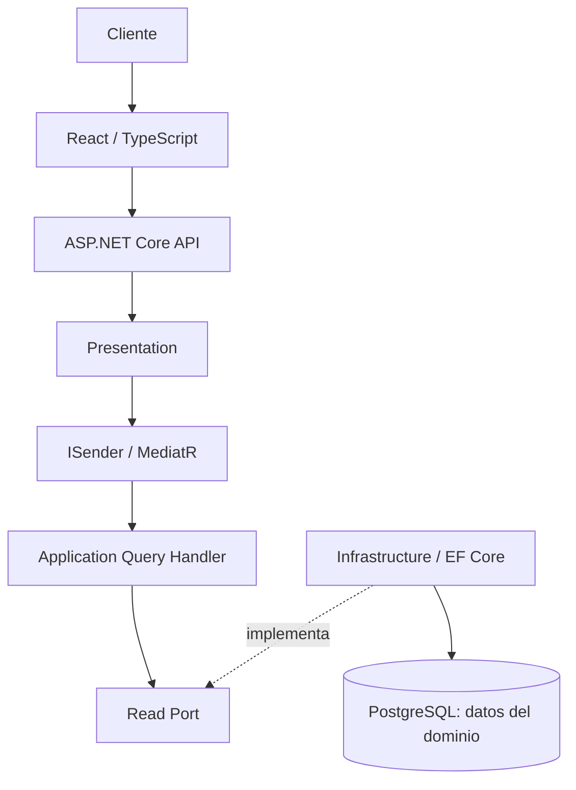

Consulta administrativa:

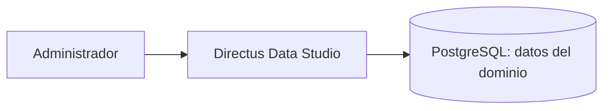

Mutación administrativa:

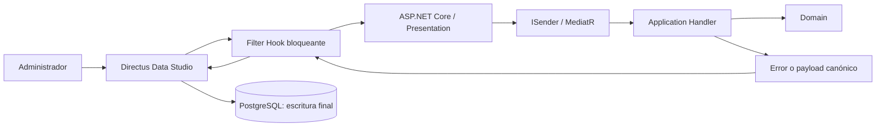

Reglas del flujo:

1. El Cliente interactúa solo con React y no se autentica.
2. React consume exclusivamente ASP.NET Core.
3. Presentation traduce HTTP y despacha casos de uso mediante MediatR.
4. Application coordina el caso de uso y depende de Domain y de abstracciones hacia el interior.
5. Infrastructure implementa los ports y accede a PostgreSQL mediante EF Core.
6. El Administrador se autentica en Directus; Data Studio lee PostgreSQL directamente para consultas administrativas.
7. React nunca consume Directus y Directus no reemplaza la ASP.NET Core API.
8. Toda mutación administrativa se intercepta antes de persistirse mediante un Filter Hook bloqueante.
9. ASP.NET Core autoriza, rechaza o transforma la intención; Directus ejecuta la única escritura final.
10. EF Core controla schema y migrations, aunque Directus lea y escriba datos aprobados.

Los identificadores Mermaid `client` y `administrator` son únicamente nombres técnicos de nodos y no expresan patrones de diseño. Las consultas administrativas no pasan por ASP.NET Core. En las mutaciones, Application orquesta Domain antes de que Directus persista, evitando una doble escritura.

## Monolito modular

Todos los módulos forman parte del mismo backend, proceso de aplicación y deployment. Comparten PostgreSQL, pero no comparten libremente su implementación.

El enfoque permite:

- Despliegue y operación iniciales simples.
- Transacciones y observabilidad dentro de una sola aplicación cuando estén justificadas.
- Límites de negocio explícitos sin asumir el costo de microservicios.
- Evolución independiente del interior de un módulo mientras se conservan sus contratos públicos.

Compartir proceso y base de datos no autoriza a saltarse límites. Un módulo no debe consultar directamente tablas de otro ni importar su código interno. Si necesita una capacidad ajena, debe consumir un contrato explícito del API público de ese módulo.

## Bounded Contexts definitivos

Los límites iniciales ya fueron definidos por lenguaje, modelo y responsabilidad. No son candidatos provisionales:

```text
modules/
├── Portfolio/
├── Services/
├── CompanyProfile/
└── Contact/
```

| Bounded Context | Aggregate Roots | Entities internas | Responsabilidad |
| --- | --- | --- | --- |
| `Portfolio` | `Project`, `CorporateClient` | `ProjectMedia` dentro de `Project` | Portafolio real de trabajos realizados |
| `Services` | `Service`, `ServiceCategory` | — | Oferta comercial y categorías de trabajo |
| `CompanyProfile` | `CompanyContactInformation` | `CompanyLocation` | Datos administrables para contactar y localizar la empresa |
| `Contact` | `ContactRequest` | — | Procesamiento de solicitudes del formulario |

`SocialLink` es un Value Object de `CompanyProfile`, no una Entity. `Projects`, `CorporateClients`, `Location`, `Categories` y `Media` no son módulos independientes. Tampoco se crearán `Identity`, `Users`, `Site` o `SiteSettings` sin un requisito futuro explícito.

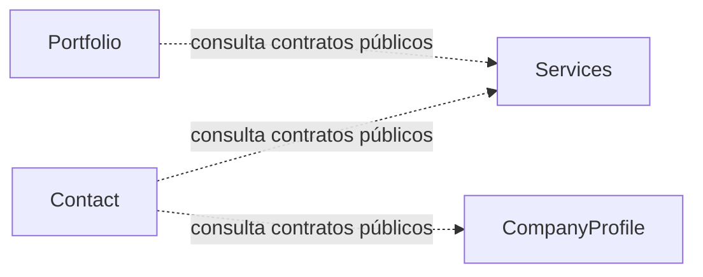

Las relaciones punteadas son dependencias de Application hacia `public/` del contexto proveedor. No representan dependencias `Domain → Domain` ni acceso a `internal/` ajeno.

## DDD y Bounded Contexts

El backend aplica Domain-Driven Design de forma pragmática. Se utilizan lenguaje ubicuo, invariantes, Entities, Aggregate Roots, Value Objects, Domain Services y Domain Events únicamente cuando expresan reglas o límites reales. DDD no exige un Aggregate por tabla, un Value Object por primitivo, un Domain Service por método, un Domain Event por CRUD ni un Bounded Context por Entity.

Un **Bounded Context** establece un límite dentro del cual un lenguaje y un modelo tienen significado consistente. Se define por semántica, capacidades y reglas del negocio, no por tablas, carpetas o conveniencia técnica. `Portfolio`, `Services`, `CompanyProfile` y `Contact` son los cuatro Bounded Contexts iniciales aprobados.

Entre módulos o Bounded Contexts se usan contratos explícitos y mínimos. No se comparten directamente Entities o Aggregate Roots, no se accede a tablas ajenas y no se importa `internal/` de otro módulo. Si el mismo término necesita significados diferentes entre contextos, cada modelo conserva su propia representación y la traducción ocurre en la frontera acordada.

No se crea un Shared Kernel solo porque distintos contextos utilicen nombres como `EmailAddress`, `PhoneNumber` o `MediaReference`. Cada contexto puede proteger reglas y representaciones propias. Tampoco se crea un enum universal de estado: publicación, visibilidad y disponibilidad comercial tienen significados distintos.

## Modelo de `Portfolio`

`Portfolio` representa principalmente el trabajo realizado por Cromática Creativa. Contiene dos Aggregate Roots:

```text
Portfolio
├── Project [Aggregate Root]
│   └── ProjectMedia[] [Entity]
└── CorporateClient [Aggregate Root]
```

### `Project` — Aggregate Root

Modelo mínimo conceptual:

```text
Project
├── ProjectId
├── ProjectTitle?
├── Description
├── PublicationStatus
├── DisplayOrder
├── CorporateClientId?
├── ProjectServiceReference
├── ProjectCategoryReference
├── ProjectPeriod
├── CoverMediaId?
└── ProjectMedia[]
```

`Project` protege su publicación, controla la colección multimedia, conserva como máximo una referencia a un `CorporateClient` principal y representa el Service, ServiceCategory y período correspondientes al trabajo. `PublicationStatus` usa `Draft` y `Published`; un Draft puede no tener `ProjectTitle`, pero `Publish()` rechaza la transición mientras no exista un título válido. Solo Projects publicados y que cumplan sus invariantes pueden aparecer públicamente.

La FK interna `portfolio.project.corporate_client_id` usa `RESTRICT`: un `CorporateClient` referenciado no se elimina físicamente. Para retirarlo de publicación se utiliza `VisibilityStatus.Hidden`; cualquier eliminación futura deberá comprobar sus Projects y decidir explícitamente su tratamiento.

### `ProjectPeriod` — Value Object

```text
ProjectPeriod
├── StartDate
├── EndDate
└── TotalDays = EndDate - StartDate
```

`ProjectPeriod` protege como mínimo `EndDate >= StartDate`. `TotalDays` es derivado y no se mantiene como tercer valor independiente. Domain posee el período aunque el contrato público decida mostrar ambas fechas, solo la duración o ninguna; esa exposición HTTP/UI permanece pendiente.

### `ProjectMedia` — Entity

```text
ProjectMedia
├── ProjectMediaId
├── MediaReference
├── MediaType
└── DisplayOrder
```

`ProjectMedia` tiene identidad dentro del Aggregate y no existe independientemente de `Project`. Toda modificación relevante pasa por la API de `Project`; Handlers y adaptadores no manipulan directamente la colección. `MediaType` puede distinguir conceptualmente `Image` y `Video` si la implementación confirma que es necesario.

### `CorporateClient` — Aggregate Root

```text
CorporateClient
├── CorporateClientId
├── CorporateClientName
├── Logo / MediaReference
└── VisibilityStatus
```

Representa una empresa o marca con la que Cromática Creativa ha trabajado. Puede existir independientemente de un `Project`. El proyecto mantiene como máximo su identificador o referencia aprobada, nunca el Aggregate completo. `VisibilityStatus` conserva su significado propio y no se reemplaza por el estado `Active`/`Inactive` de Services.

## Modelo de `Services`

`Services` representa la oferta comercial actual y puede evolucionar si en el futuro algún servicio se solicita o ejecuta desde el sitio. Sus Aggregate Roots iniciales son `Service` y `ServiceCategory`; no existe un módulo `Categories`.

### `Service` — Aggregate Root

```text
Service
├── ServiceId
├── ServiceName
├── Description
├── Image / MediaReference
├── ServiceStatus
│   ├── Active
│   └── Inactive
└── DisplayOrder
```

Solo un `Service` Active forma parte de la oferta pública. Un Service Inactive continúa disponible administrativamente en Directus y no se elimina automáticamente.

### `ServiceCategory` — Aggregate Root

```text
ServiceCategory
├── ServiceCategoryId
├── ServiceId
├── ServiceCategoryName
├── Description
├── ReferenceImage / MediaReference
├── ServiceCategoryStatus
│   ├── Active
│   └── Inactive
└── DisplayOrder
```

`ServiceCategory` tiene identidad y ciclo de vida propios, se administra individualmente, se consulta y filtra públicamente y puede ser referenciada por Project. Cada Category pertenece a exactamente un Service; Application debe poder comprobar que la Category pertenece al Service indicado.

Solo una ServiceCategory Active cuyo Service padre también esté Active puede exponerse como categoría pública disponible. No se ha decidido que desactivar una categoría o su Service oculte automáticamente Projects históricos relacionados.

Cada `ServiceCategory` debe tener `ReferenceImage`: una imagen ilustrativa que ayuda al Cliente a comprender el tipo de trabajo. No es un Project real ni equivale a `ProjectMedia`, que contiene fotografías o videos reales de un trabajo realizado.

## Relación `Portfolio` → `Services`

`Portfolio.Domain` no depende de `Services.Domain`, sus identificadores ni sus Aggregate Roots. `Project` usa Value Objects propios:

```text
Project
├── ProjectServiceReference
└── ProjectCategoryReference
```

`Portfolio.Application` recibe la selección, consulta un contrato mínimo de `Services/public/`, verifica que Service y Category existan, que la Category pertenezca al Service y las condiciones de estado necesarias para el caso de uso. Solo después crea las referencias propias de Portfolio.

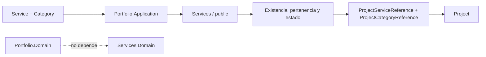

La implementación inicial de cada referencia almacena únicamente un `Guid` no vacío propio de `Portfolio.Domain`; no importa identificadores ni Aggregates de `Services.Domain`. Incorporar snapshots en el futuro requerirá un requisito nuevo. No se fijan interfaces/facades antes de que un caso de uso las necesite.

### Filtros públicos

La arquitectura permite consultar la oferta como `Service → ServiceCategories activas` y filtrar el portafolio por Service y ServiceCategory. El resultado de Portfolio incluye únicamente Projects que cumplan sus reglas públicas de publicación. Estas capacidades son requisitos conceptuales; no fijan rutas HTTP ni declaran endpoints implementados.

## Modelo de `CompanyProfile`

`CompanyProfile` reúne la información administrable para contactar y localizar a Cromática Creativa:

```text
CompanyContactInformation [Aggregate Root]
├── CompanyContactInformationId
├── PhoneNumber?
├── PhoneNumber? WhatsApp
├── PublicEmail?
├── ContactRequestRecipientEmail
├── SocialLink[] [Value Objects]
└── CompanyLocation? [Entity]
```

`CompanyContactInformation` controla el ciclo de vida de su ubicación y redes sociales. `CompanyLocation` no es Aggregate Root ni módulo independiente:

```text
CompanyLocation
├── CompanyLocationId
├── Address
└── GeoCoordinates?
```

`SocialLink` es un Value Object inmutable, sin `SocialLinkId`, compuesto conceptualmente por `SocialNetwork` y `ExternalUrl`. Cuando cambia una URL, se reemplaza el valor.

`ContactRequestRecipientEmail` es el correo receptor administrable de las solicitudes. Es distinto de `PublicEmail` y del correo emisor técnico del proveedor, y no se hardcodea en `Contact`, React o Infrastructure.

El contrato de `CompanyProfile/public/` que permite obtenerlo es público entre módulos, no necesariamente HTTP. El destinatario no se expone al Cliente o React sin un requisito explícito independiente.

Teléfono, WhatsApp, correo público, SocialLinks y CompanyLocation se exponen públicamente solo cuando estén configurados conforme a las reglas del Aggregate. La opcionalidad no justifica inventar estados o Entities adicionales.

## Modelo de `Contact`

`Contact` tiene una única responsabilidad: procesar solicitudes enviadas por Clientes desde el formulario. No administra teléfonos, redes sociales, ubicación ni correo público de Cromática Creativa.

```text
ContactRequest [Aggregate Root]
├── ContactRequestId
├── PersonName
├── CompanyName?
├── EmailAddress
├── PhoneNumber
├── RequestType
├── RequestedServiceReference
└── Message?
```

`ContactRequest` representa una solicitud válida y protege sus reglas propias. `RequestType` contiene inicialmente `InformationRequest` y `ServiceRequest`; `Message` permanece opcional. Ser Aggregate Root define un límite de consistencia; no obliga a crear una tabla ni a persistir históricamente las solicitudes en V1. El Aggregate tampoco envía correo: ese efecto pertenece a Application mediante un port.

Los Value Objects conceptuales confirmados por contexto son:

| Contexto | Value Objects |
| --- | --- |
| `Portfolio` | `ProjectId`, `ProjectMediaId`, `CorporateClientId`, `ProjectTitle`, `CorporateClientName`, `MediaReference`, `DisplayOrder`, `ProjectPeriod`, `ProjectServiceReference`, `ProjectCategoryReference` |
| `Services` | `ServiceId`, `ServiceName`, `ServiceCategoryId`, `ServiceCategoryName`, `MediaReference`, `DisplayOrder` |
| `CompanyProfile` | `CompanyContactInformationId`, `CompanyLocationId`, `EmailAddress`, `PhoneNumber`, `Address`, `GeoCoordinates`, `ExternalUrl`, `SocialLink` |
| `Contact` | `ContactRequestId`, `PersonName`, `EmailAddress`, `PhoneNumber`, `RequestedServiceReference` |

Estos Value Objects ya están implementados dentro del proyecto Domain de su contexto. Los nombres repetidos conservan implementaciones independientes y no crean un Shared Kernel.

## Anatomía de un módulo

La separación de capas se materializa en proyectos distintos:

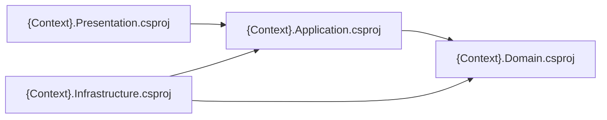

Estructura física aprobada, ejemplificada con `Portfolio`:

```text
modules/
└── Portfolio/
    ├── CromaticaCreativa.Modules.Portfolio.Domain/
    │   ├── Aggregates/
    │   ├── Entities/
    │   ├── Enums/
    │   ├── Exceptions/
    │   └── ValueObjects/
    ├── CromaticaCreativa.Modules.Portfolio.Application/
    ├── CromaticaCreativa.Modules.Portfolio.Infrastructure/
    └── CromaticaCreativa.Modules.Portfolio.Presentation/
```

El mismo patrón se aplica a `Services`, `CompanyProfile` y `Contact`. `backend/Directory.Build.props` centraliza `net10.0`, nullable reference types e implicit usings; `global.json` fija el SDK `10.0.302`. Application y Presentation permanecen sin lógica funcional. Los Infrastructure de `Portfolio`, `Services` y `CompanyProfile` contienen su persistencia y referencian exclusivamente al Domain del mismo contexto para sus mappers; `Contact.Infrastructure` permanece vacío y sin referencias anticipadas.

### `public` frente a `internal`

La frontera `public` será el único punto permitido de interacción desde otros módulos. Se materializará cuando una historia de usuario necesite DTOs, contratos/facades o Integration Events estables; no existe todavía un proyecto `Contracts` o `Public` porque no hay consumidor real.

Los cuatro proyectos de capa contienen la implementación propia del Bounded Context. Ningún otro módulo puede importar, instanciar o depender de sus tipos internos sin atravesar el futuro contrato público explícito.

`public/` no equivale a endpoint público. Un contrato entre módulos puede no tener representación HTTP; un endpoint pertenece a Presentation y responde al contrato externo de la API REST.

## Arquitectura hexagonal

Domain y Application forman el núcleo. Presentation e Infrastructure actúan como adaptadores; los mecanismos externos se conectan mediante ports manteniendo la dirección de dependencias hacia el interior.

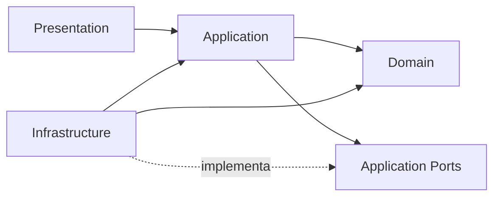

**Las flechas representan dependencias de código. `Application Ports` no es una quinta capa: es la parte de Application que declara las capacidades externas que sus casos de uso necesitan. Domain no conoce ninguna capa externa. Application conoce Domain, pero no Infrastructure ni Presentation.** Infrastructure puede depender de Application o Domain únicamente para implementar contratos, configurar mappings o adaptar recursos técnicos compatibles con esas capas.

Los flujos en tiempo de ejecución no invierten esas dependencias. Por ejemplo, Application invoca un port propio e Infrastructure aporta la implementación mediante Dependency Injection:

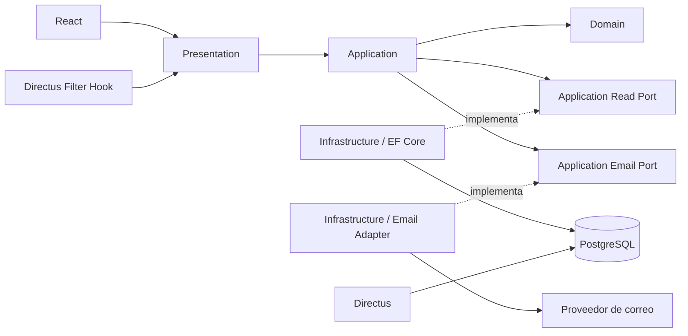

El acceso Directus → PostgreSQL representa consultas administrativas y la persistencia final de mutaciones ya aprobadas. No convierte a Directus en propietario del esquema.

### Domain

Responsable de las reglas e invariantes del negocio. Puede incluir Entities, Aggregate Roots, Value Objects, Domain Events, Domain Exceptions y Domain Services solo cuando sean necesarios.

Las **Domain Exceptions** se reservan para violaciones reales del negocio: invariantes, estados inválidos de un Aggregate, creación inválida de un Value Object u operaciones no permitidas por una regla de dominio. No se crea una excepción por cada error. `DomainException`, `ProjectCannotBePublishedException` e `InvalidProjectStateException` son ejemplos conceptuales de forma y significado; no fijan una jerarquía ni se consideran implementados. Un timeout SMTP, una caída de PostgreSQL o un fallo de filesystem nunca es una Domain Exception.

No depende de Application, Infrastructure, Presentation, EF Core, ASP.NET Core, MediatR, Directus, PostgreSQL, HTTP ni SDKs externos. No debe contener atributos o tipos de frameworks que comprometan esa independencia.

Las **Entities** tienen identidad y ciclo de vida. Un **Aggregate** define un límite de consistencia y su Aggregate Root protege las invariantes internas. Cuando existan comportamientos como publicar, cambiar un título o asociar multimedia, Application debe invocar la API explícita del Aggregate en vez de modificar su estado por setters o reproducir sus condiciones en el Handler. Esos comportamientos son ejemplos potenciales, no métodos ya definidos.

Los **Value Objects** pertenecen a Domain cuando un concepto se define por sus valores, protege invariantes, necesita validación coherente o evita primitivas ambiguas. Deben ser inmutables, válidos desde su creación, comparados por valor e independientes de Infrastructure. Los Value Objects confirmados se enumeran en el modelo de cada contexto; no se permite crear primero uno inválido para validarlo después en Application.

Los **Domain Services** se reservan para reglas de dominio que no pertenecen naturalmente a una Entity, Aggregate o Value Object. Los **Domain Events** representan hechos relevantes ya ocurridos; no se crean para cada CRUD.

Una interfaz puede residir en `domain/abstractions/` solo cuando representa una capacidad necesaria para expresar una regla puramente de dominio y su significado forma parte del lenguaje ubicuo. Esa carpeta no es un depósito general de interfaces. Ports para correo, storage, read stores, gateways, servicios externos o un reloj usado únicamente por un caso de uso pertenecen normalmente a Application.

### Application

Implementa casos de uso y orquesta Domain. Contiene Commands, Queries, Handlers, DTOs propios del caso de uso y ports requeridos para interactuar con recursos externos.

**Application sí utiliza Domain.** Puede depender de Domain y, cuando corresponda, de contratos públicos de otros módulos. Un Handler puede obtener estado mediante un port, reconstruir o cargar un Aggregate, invocar su comportamiento, interpretar el resultado y coordinar efectos externos mediante otros ports. No debe copiar en el Handler las invariantes que pertenecen al Aggregate, Entity o Value Object.

Application valida datos y precondiciones propios del caso de uso: parámetros requeridos, formato contextual, existencia de recursos, autorización de aplicación y coherencia entre entradas. Por ejemplo, comprobar que se recibió un identificador de servicio y que el servicio existe es validación de Application; decidir si un Project puede publicarse en su estado actual es una invariante de Domain.

Cada Command o Query se organiza en una carpeta por caso de uso, junto con su Handler. DTOs y validadores específicos pueden co-localizarse cuando tengan esa única responsabilidad; no se centralizan todos los mensajes o Handlers en archivos masivos. No se selecciona todavía una librería de validación.

Application no conoce implementaciones de Infrastructure, detalles HTTP, ASP.NET Core, EF Core, `DbContext` o Directus. Declara ports orientados a capacidades y recibe sus implementaciones mediante Dependency Injection.

La prohibición correcta no es “Application nunca utiliza `new`”. Application no instancia dependencias técnicas como `DbContext`, clientes de Directus, adaptadores de correo o repositorios concretos. Sí puede crear objetos de Domain cuando el diseño lo permite; si la creación protege invariantes complejas, se prefiere un constructor seguro, un método `Create` o una Domain Factory equivalente.

### Infrastructure

Contiene adaptadores técnicos: `DbContext`, configuraciones EF Core, migrations, consultas PostgreSQL, almacenamiento multimedia, correo e integraciones externas, además de implementaciones de ports específicos.

También contiene el acceso al reloj del sistema y traduce los fallos de SMTP/proveedor, filesystem, storage, EF Core, PostgreSQL o APIs externas al contrato que espera la capa interior. Esos detalles no se filtran hacia Domain ni se convierten en reglas de negocio.

Puede depender de Application y Domain para implementar sus contratos, pero estos no dependen de Infrastructure. No aloja reglas de negocio.

Repository Pattern no es obligatorio. No se introducen `IGenericRepository<T>` ni repositorios por agregado de forma automática; pueden existir ports orientados a una capacidad o caso de uso, como un read store, cuando aporten valor.

### Presentation

Traduce solicitudes y respuestas HTTP, realiza mapping de transporte, selecciona códigos HTTP y despacha Commands o Queries mediante MediatR. Depende de Application. No implementa reglas de negocio, no manipula Aggregate Roots para evitar Application, no crea adaptadores de Infrastructure ni utiliza directamente EF Core, `DbContext` o PostgreSQL.

Presentation mapea resultados y errores aprobados a respuestas seguras. Nunca expone stack traces, SQL, detalles SMTP, credenciales, configuración ni excepciones internas. La estrategia concreta —excepciones, resultados explícitos o una combinación— y el catálogo de códigos HTTP permanecen pendientes hasta que existan contratos implementados.

La decisión entre Controllers y Minimal APIs permanece pendiente. Cualquiera de los dos deberá respetar las mismas reglas.

## Regla de dependencias

Dependencias permitidas conceptualmente:

| Origen | Puede depender de | No debe depender de |
| --- | --- | --- |
| Domain | Tipos propios del dominio | Application, Infrastructure, Presentation, frameworks |
| Application | Domain, ports propios, `public/` de otros módulos cuando sea necesario | Infrastructure, ASP.NET Core, detalles de EF Core |
| Infrastructure | Application, Domain, librerías técnicas | Presentation, `internal/` de otros módulos |
| Presentation | Application, contratos de transporte y composición autorizada | Persistencia directa, reglas de Domain implementadas en endpoints |
| Otro módulo | `public/` del módulo proveedor | `internal/` del módulo proveedor |

Dependencias prohibidas:

```text
Domain → Application / Infrastructure / Presentation
Application → Infrastructure / Presentation
```

La composición en el host puede registrar implementaciones de Infrastructure para ports del núcleo mediante Dependency Injection; esa composición no autoriza a Application a construir o referenciar los adaptadores concretos.

## Clasificación de errores por capa

La clasificación responde al significado y a la responsabilidad del fallo, con independencia de que la implementación futura use excepciones, resultados explícitos o ambos:

| Capa | Responsabilidad | Ejemplos conceptuales |
| --- | --- | --- |
| Domain | Violaciones de invariantes, estados inválidos del modelo, Value Objects inválidos y operaciones de negocio no permitidas | Un proyecto no puede publicarse en su estado actual |
| Application | Entrada del caso de uso, recurso requerido ausente, precondición de aplicación o validación contextual | El servicio solicitado no existe; falta un parámetro requerido |
| Infrastructure | Fallos de EF Core/PostgreSQL, SMTP/proveedor, filesystem, storage o APIs externas | Timeout del proveedor; conexión de base de datos no disponible |
| Presentation | Traducción segura del resultado aprobado al contrato HTTP | Código y payload públicos sin detalles internos |

Infrastructure captura o traduce el fallo técnico en su frontera al contrato que Application espera. No lo transforma en Domain Exception ni deja que Domain conozca al proveedor. Presentation tampoco serializa una excepción interna: recibe un resultado/error permitido y aplica el mapping HTTP que se defina.

## Application Ports y Dependency Inversion

La capa que necesita una capacidad define la abstracción. Por defecto, los recursos externos utilizados para ejecutar un caso de uso se representan mediante ports mínimos en `internal/application/ports/`; Infrastructure los implementa y el composition root los registra mediante Dependency Injection.

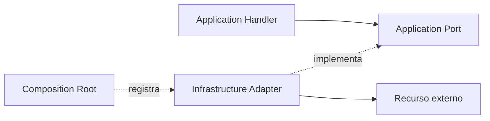

`IClock`, `IEmailSender`, `IProjectReadStore` e `IMediaStorage` son nombres conceptuales para explicar capacidades posibles, no interfaces implementadas ni contratos definitivos. Un Handler depende del port apropiado, nunca de clases concretas como `SystemClock`, `SmtpEmailSender`, un `DbContext` o el SDK de un proveedor.

`domain/abstractions/` conserva únicamente interfaces cuyo significado pertenece genuinamente al lenguaje y a una regla de Domain. El hecho de que una interfaz sea abstracta no la convierte en una abstracción de dominio: reloj, correo, storage, read stores, filesystem y APIs externas pertenecen normalmente a Application Ports.

### Tiempo mediante `IClock`

Cuando la hora actual participa en el comportamiento y debe ser controlable en tests, Application no llama directamente a `DateTime.Now` ni `DateTime.UtcNow`. Obtiene el instante desde un port conceptual `IClock` y lo entrega explícitamente a Domain. Domain evalúa sus reglas con ese valor; nunca consulta el reloj del sistema.

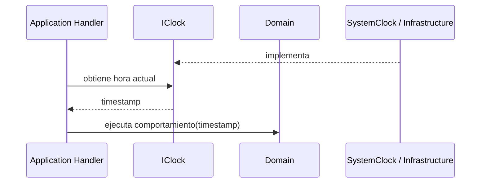

`IClock` reside por defecto en Application porque expresa una necesidad de orquestación del caso de uso. Solo se reevaluaría una abstracción en Domain si una regla autónoma del dominio exigiera genuinamente esa capacidad. `SystemClock` es un nombre conceptual para el adaptador de Infrastructure; la propiedad o método exactos, el tipo temporal y el namespace no se fijan todavía.

### Correo y otros servicios externos

El correo sigue el mismo patrón: Application declara un port orientado a enviar el mensaje que el caso de uso requiere; Infrastructure adapta el proveedor seleccionado. Application no crea `SmtpClient`, no referencia SDKs y no conoce credenciales, configuración del `From` ni detalles del transporte. En Contact, el Handler recibe el `To` desde `CompanyProfile/public/`. El proveedor y el contrato técnico definitivo permanecen pendientes.

Filesystem, almacenamiento multimedia, read stores y APIs externas se tratan del mismo modo. El port debe expresar la capacidad mínima necesaria para el caso de uso, no reproducir la API del proveedor ni convertirse en un Generic Repository.

## CQRS y MediatR

CQRS separa lectura y escritura cuando ambas responsabilidades existen; no obliga a que todos los módulos contengan Commands y Queries:

- Una Query obtiene datos y no modifica el estado observable.
- Un Command expresa una intención de cambio.
- Un Handler implementa un único caso de uso y recibe sus dependencias por inyección.
- MediatR despacha Commands y Queries desde Presentation.

Estructura conceptual por caso de uso:

```text
application/
├── commands/
│   └── PublishProject/
│       ├── PublishProjectCommand.cs
│       ├── PublishProjectCommandHandler.cs
│       └── PublishProjectCommandValidator.cs  # opcional
└── queries/
    └── GetProjectById/
        ├── GetProjectByIdQuery.cs
        ├── GetProjectByIdQueryHandler.cs
        └── ProjectDto.cs                       # local si corresponde
```

Los nombres son ejemplos conceptuales en inglés. Un Command contiene solo los datos de entrada de la intención; no incluye `DbContext`, implementaciones concretas, modelos de Infrastructure ni detalles de Directus, SMTP o proveedores. Una Query es estrictamente de lectura: no envía correo, no escribe, no muta Aggregates ni produce efectos. Cuando solo necesita una proyección, usa un read port implementado por Infrastructure sin reconstruir el Aggregate.

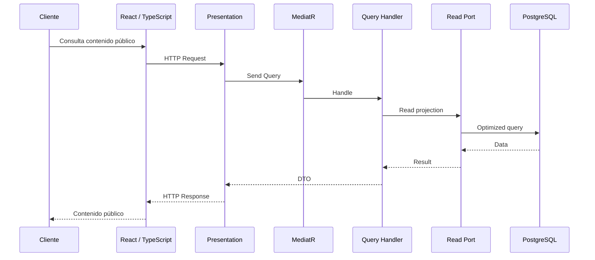

Las lecturas públicas serán principalmente Queries. El formulario público es una acción con un efecto externo y requiere un Command; una Query no puede enviar correos. Las mutaciones administrativas necesitan Commands porque el Filter Hook invoca ASP.NET Core antes de permitir que Directus escriba. El Handler administrativo puede leer estado mediante un port implementado con EF Core, reconstruir un Aggregate, ejecutar comportamiento y devolver un error o payload canónico; no persiste con EF Core la misma mutación que Directus ejecutará después.

“Leer mediante EF Core” significa que el Handler usa un port de Application implementado por Infrastructure; Application no referencia `DbContext`. Una Query puede utilizar un read port con `AsNoTracking()` y proyección directa a DTO sin cargar un Aggregate cuando solo necesita datos. Un Command carga el estado requerido, invoca Domain y coordina ports; no implementa dentro del Handler reglas que pertenecen al modelo de dominio.

| Bounded Context | Commands conceptuales | Queries conceptuales |
| --- | --- | --- |
| `Portfolio` | Commands de Project o CorporateClient solo para casos reales | `GetProjectsQuery`, `GetProjectByIdQuery` o consultas de CorporateClient |
| `Services` | Commands de Service o ServiceCategory solo para casos reales | `GetServicesQuery` y consultas de categorías requeridas por consumidores reales |
| `CompanyProfile` | Commands para administrar `CompanyContactInformation` cuando existan | Queries de información pública o contrato interno para el destinatario |
| `Contact` | `SubmitContactRequestCommand` | No se anticipan Queries sin una necesidad real, especialmente mientras no haya persistencia histórica |

Todos son ejemplos conceptuales; no representan código ni endpoints implementados. `GetProjectsQuery` pertenece a `Portfolio.Application`: el plural Projects describe el caso de uso y no un módulo independiente.

No se crearán mensajes CRUD ajenos al ERS. CQRS no implica Event Sourcing y este proyecto no utilizará Event Sourcing salvo decisión futura explícita.

Para una mutación originada en Directus, `Command` describe la intención y el procesamiento, no implica necesariamente `SaveChanges`. Ejecutar EF Core y Directus como dos escritores de la misma operación está prohibido.

## Formulario público de contacto

El Bounded Context `Contact` procesa la solicitud; `CompanyProfile` administra los datos corporativos. El formulario no justifica mezclar ambas responsabilidades.

La solicitud se representa en Domain mediante `ContactRequest`, con `PersonName`, empresa opcional, `EmailAddress`, `PhoneNumber`, `RequestType`, `RequestedServiceReference` y mensaje opcional. `RequestType` admite actualmente `InformationRequest` y `ServiceRequest`; ampliar ese catálogo requerirá un requisito explícito. La obligatoriedad futura de `Message` permanece pendiente.

Flujo de envío:

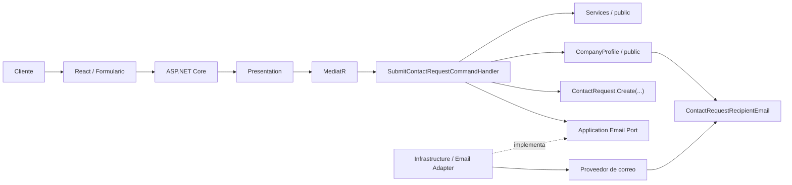

`SubmitContactRequestCommand` representa la intención y su Handler orquesta validación, contratos públicos, Domain y entrega. Application declara el email port e Infrastructure implementa el adaptador. Application y Domain no conocen SMTP, SDKs ni proveedores concretos.

La separación del mensaje es obligatoria:

| Campo técnico | Origen |
| --- | --- |
| `From` | Dirección técnica controlada por Cromática Creativa o requerida por el proveedor, configurada en Infrastructure |
| `To` | `ContactRequestRecipientEmail`, obtenido mediante `CompanyProfile/public/` |
| `Reply-To` | `EmailAddress` aportado por el Cliente y validado dentro de la solicitud |

Proveedor, asunto, HTML y texto plano permanecen pendientes. El Cliente nunca controla `From`, `To`, credenciales o plantillas.

Directus y los Filter Hooks administrativos no participan en este flujo. React tampoco envía correo ni accede a PostgreSQL. `ContactRequest` es Aggregate Root aunque su persistencia histórica continúe pendiente; no se crea una tabla automáticamente.

### Relaciones de `Contact.Application`

React construye el selector a partir de servicios públicos obtenidos mediante el flujo existente:

```text
Cliente → React → ASP.NET Core → GetServicesQuery → EF Core → PostgreSQL
```

El nombre `GetServicesQuery` es conceptual y no afirma implementación. Al enviar el formulario, el Cliente proporciona un identificador apropiado, no texto arbitrario que suplante al servicio. Application vuelve a comprobar que el servicio existe, es válido y, si el modelo incorpora ese concepto, está disponible o publicado.

`Contact` no puede acceder a `Services/internal/`, a su `DbContext` ni a sus tablas. La verificación atraviesa un contrato mínimo de `Services/public/`, sin fijar todavía nombres de interfaces. La lista de servicios no se duplica manualmente en `Contact` ni en React.

El Handler obtiene `ContactRequestRecipientEmail` mediante `CompanyProfile/public/`; no accede a `CompanyProfile/internal/` ni trata el destinatario como configuración técnica del adaptador de correo.

### Validación, seguridad y resultados

- React aporta UX: campos requeridos, formato visual, límites de longitud, selector y feedback inmediato; estas comprobaciones no son una frontera de seguridad.
- Presentation/Application vuelven a validar obligatoriedad, formatos, longitudes, correo, teléfono según reglas aprobadas, tipo de solicitud, servicio y consistencia.
- Domain crea un `ContactRequest` válido y protege sus invariantes; el Aggregate no conoce Services, CompanyProfile ni el proveedor de correo.
- Infrastructure se limita a la entrega técnica del correo y traduce fallos del proveedor sin filtrar sus detalles.
- El endpoint será público y sin autenticación. Antes de producción deben evaluarse rate limiting, spam, automatización abusiva, límites de tamaño, tratamiento seguro del contenido y observabilidad. CAPTCHA es una alternativa posible, no una decisión obligatoria.
- Ningún parámetro del Cliente puede decidir destinatarios, encabezados, plantillas, credenciales o configuración interna.

El contrato deberá distinguir conceptualmente entre envío correcto, entrada inválida, servicio inexistente, tipo de solicitud inválido, fallo temporal del proveedor y rate limit cuando exista. Los códigos HTTP concretos dependen de la convención global todavía pendiente. Nunca se devuelven stack traces, credenciales, configuración técnica ni detalles sensibles del proveedor.

## Persistencia, EF Core y PostgreSQL

EF Core es el ORM y propietario de la definición versionada del esquema. El proceso obligatorio para cambiarlo será:

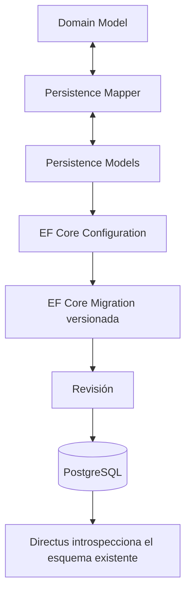

- Domain y Persistence son modelos distintos. Los Aggregates, Entities y Value Objects de Domain no son entidades EF, no reciben atributos de persistencia y no aparecen en `DbSet`.
- Los Persistence Models técnicos usan el sufijo `Model`; las configuraciones y mappers permanecen en Infrastructure.
- Las migrations son la única vía aprobada para evolucionar el esquema desde la aplicación.
- `PortfolioDbContext` posee el schema `portfolio`, sus tablas y sus migrations.
- `ServicesDbContext` posee el schema `services`, sus tablas y sus migrations.
- `CompanyProfileDbContext` posee el schema `company_profile`, sus tablas y sus migrations.
- Cada contexto usa `schema.__ef_migrations_history`. No existe un `DbContext` global ni migrations compartidas.
- `Contact` no tiene `ContactDbContext`; `ContactRequest` permanece exclusivamente en Domain y no tiene tabla.
- Las tablas y columnas son singulares `snake_case`; constraints e índices tienen nombres explícitos `pk_`, `fk_`, `uq_`, `ck_` e `ix_`.
- Las FKs solo existen dentro del Bounded Context propietario. `portfolio.project.service_id` y `category_id` son UUID opacos sin FK ni navegación hacia Services; Application validará esas referencias mediante contratos públicos futuros.
- `CorporateClient → Project` y `Service → Category` usan `RESTRICT`; `Project → Media` y los hijos relacionales de CompanyProfile usan `CASCADE`.
- `media.is_cover` y un índice único parcial por `project_id` garantizan como máximo una portada por Project.
- `company_profile.singleton_key = 1`, con `UNIQUE`, garantiza una única fila raíz de CompanyProfile.

| Contexto | Persistence Model | Tabla física |
| --- | --- | --- |
| Portfolio | `ProjectModel` | `portfolio.project` |
| Portfolio | `MediaModel` | `portfolio.media` |
| Portfolio | `CorporateClientModel` | `portfolio.corporate_client` |
| Services | `ServiceModel` | `services.service` |
| Services | `CategoryModel` | `services.category` |
| CompanyProfile | `CompanyProfileModel` | `company_profile.company_profile` |
| CompanyProfile | `PhoneModel` | `company_profile.phone` |
| CompanyProfile | `EmailModel` | `company_profile.email` |
| CompanyProfile | `LocationModel` | `company_profile.location` |
| CompanyProfile | `SocialLinkModel` | `company_profile.social_link` |

- ASP.NET Core usa EF Core para consultas públicas y para recuperar estado durante el procesamiento de una mutación.
- Directus lee directamente las tablas del dominio para consultas administrativas.
- Directus ejecuta el `INSERT`, `UPDATE` o `DELETE` final después de la aprobación del Filter Hook.
- Directus no debe crear o eliminar tablas/columnas del dominio, cambiar tipos, eliminar constraints, cambiar Foreign Keys o alterar relaciones fuera de EF Core Migrations.
- PostgreSQL aplica constraints reales cuando correspondan: `PRIMARY KEY`, `NOT NULL`, `UNIQUE`, `FOREIGN KEY`, `CHECK`, índices y comportamientos explícitos de `DELETE`.
- El acceso compartido a PostgreSQL no elimina el ownership modular de los datos.
- Las Queries públicas deben proyectar solo campos necesarios, evitar N+1 y usar `AsNoTracking()` cuando corresponda.

La topología física está registrada en ADR-013. Los límites transaccionales de futuros casos de uso aún se definirán por capacidad; compartir una base no autoriza transacciones o acceso directo entre implementaciones de contextos.

## Directus

Directus es una interfaz administrativa self-hosted para uno o, como máximo, dos Administradores y se conecta directamente a PostgreSQL. Proporciona autenticación, usuarios, roles, policies, permissions, formularios, Data Studio, CRUD y gestión de archivos cuando corresponda.

Responsabilidades:

- Presentar formularios y vistas administrativas.
- Consultar directamente PostgreSQL para listados, formularios y vistas administrativas.
- Ejecutar la persistencia final de mutaciones aprobadas.
- Interceptar create/update/delete mediante Filter Hooks bloqueantes.
- Autenticar al Administrador mediante credenciales administrativas individuales.
- Mantener sus propios usuarios, sesiones, permisos, configuración y metadata.

No responsabilidades:

- No es la API pública del sitio.
- No autentica al Cliente.
- No es fuente de verdad del esquema.
- No sustituye reglas de dominio que deban vivir en .NET.
- No modifica la estructura del esquema del dominio.

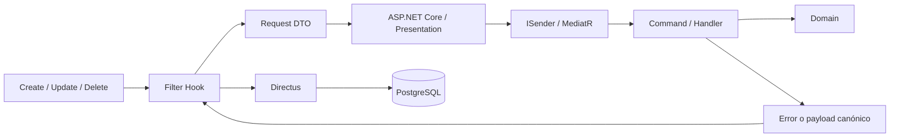

El Filter Hook se ejecuta antes de persistir, espera la respuesta del backend, cancela la mutación rechazada y puede reemplazar o normalizar el payload aprobado. Directus realiza después el único `INSERT`, `UPDATE` o `DELETE`. La comunicación Hook → ASP.NET Core deberá autenticarse y autorizarse antes de producción, pero el mecanismo técnico aún no se ha decidido.

El mismo flujo se aplica a mutaciones administrativas de Project, ProjectMedia, CorporateClient, Service, ServiceCategory, CompanyContactInformation y CompanyLocation. La pertenencia de estos conceptos a contextos distintos no permite saltarse sus Commands, invariantes o Filter Hooks.

### Persistencia interna de Directus

Los datos internos del CMS —configuración, usuarios, sesiones, roles, policies, permissions y metadata— son responsabilidad de Directus. Los datos del dominio comparten PostgreSQL técnicamente entre Directus y ASP.NET Core, pero su estructura pertenece a EF Core Migrations.

## Contenido estático y contenido dinámico

Permanece en código: misión, visión, descripción institucional general, eslóganes y textos corporativos de muy baja frecuencia de modificación. No se modelará `SiteSettings` ni un módulo equivalente solo para almacenarlos.

Se administra mediante Directus: Projects, ProjectMedia y CorporateClients de `Portfolio`; Services y ServiceCategories; y CompanyContactInformation, CompanyLocation y redes sociales de `CompanyProfile`. Directus lee estos datos directamente y persiste las mutaciones solo después de procesarlas mediante Filter Hooks y ASP.NET Core. No convierte automáticamente todo el contenido del sitio en administrable.

## DTOs y fronteras HTTP

Las Entities de Domain nunca se exponen directamente mediante HTTP.

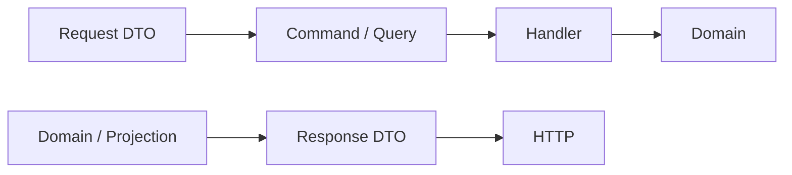

Los DTOs pertenecen a la frontera correspondiente. Los contratos consumidos por otros módulos se exponen mediante `public/`; los modelos HTTP pertenecen a Presentation o al límite que se establezca sin filtrar Entities, tipos EF Core ni detalles internos.

## Validación e integridad de datos

La validación se distribuye por responsabilidad y ninguna capa externa constituye la única protección. Para mutaciones administrativas:

1. **Directus — UX:** campos requeridos, formatos, mensajes amigables —por ejemplo, “El nombre es obligatorio” o “El correo no tiene un formato válido”— y confirmación antes de operaciones destructivas como eliminar un proyecto.
2. **Filter Hook:** interceptar la mutación antes de persistir, autenticar la llamada interna, esperar el resultado y cancelar o reemplazar el payload.
3. **Presentation / Application:** requests y DTOs, parámetros, formatos, precondiciones, existencia de recursos, consistencia del Command y errores HTTP apropiados.
4. **Domain:** invariantes y reglas reales del negocio, independientemente del origen de la solicitud.
5. **Infrastructure / PostgreSQL:** EF Core recupera estado cuando hace falta; PostgreSQL aplica integridad estructural cuando Directus realiza la escritura aprobada.

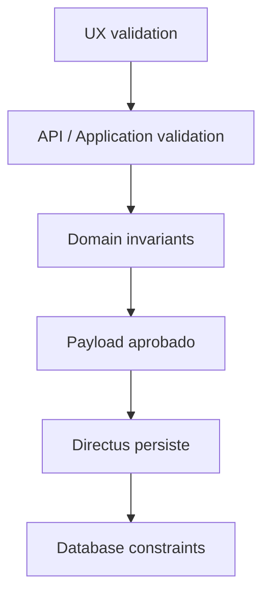

Las restricciones estructurales se definen con EF Core y se versionan mediante migrations. No se duplican reglas de dominio únicamente en Directus ni se depende exclusivamente de validaciones de frontend o CMS.

En el formulario público, React aporta únicamente la capa de UX; Directus no interviene. Presentation protege y traduce la frontera HTTP, Application valida el caso de uso, Domain protege reglas reales e Infrastructure encapsula el envío. Este flujo termina en el proveedor de correo, no en Directus ni PostgreSQL.

## Eventos

Los **Domain Events** representan hechos relevantes ocurridos dentro del dominio, permanecen dentro del monolito y pueden despacharse mediante MediatR u otro mecanismo interno apropiado. No se ha confirmado ninguno para el modelo inicial y no se crearán eventos para cada operación CRUD.

Los **Integration Events** se destinan a otros módulos, sistemas o integraciones y solo se introducen cuando existe un consumidor real. No se incorporarán Kafka, RabbitMQ, Service Bus ni otro message broker en la V1 sin un requisito explícito.

CQRS y Event Sourcing son conceptos distintos. No se utilizará Event Sourcing salvo una decisión futura explícita.

## Multimedia

El archivo físico y la metadata o referencia del dominio son responsabilidades diferentes. Las imágenes y videos no se almacenan como BLOB o base64 dentro de Entities de PostgreSQL; las tablas del dominio conservan únicamente las referencias necesarias y la asociación de `ProjectMedia` con `Project` se realiza mediante ASP.NET Core y la API del Aggregate.

`ServiceCategory.ReferenceImage` puede utilizar conceptualmente un `MediaReference`, pero expresa una imagen ilustrativa del tipo de trabajo. `ProjectMedia` representa multimedia real de un Project realizado. Compartir el tipo técnico de referencia no mezcla sus significados ni crea un módulo `Media`.

En la V1, Directus podrá realizar físicamente el upload a almacenamiento persistente del servidor VPS y obtener una referencia. La mutación que asocia esa referencia se interceptará igual que cualquier otra operación de dominio:

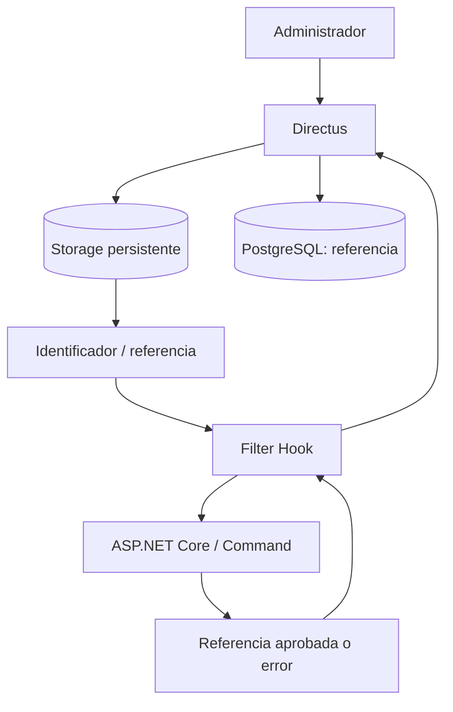

La implementación de storage no está decidida. Para videos grandes permanece abierta la posibilidad de guardar una URL externa en vez del archivo en el VPS.

## Frontend React

React y TypeScript conforman el adaptador web público utilizado por el Cliente sin autenticación. La aplicación debe ser responsive, usar HTML5 y CSS3 y centralizar su acceso HTTP. El frontend usa una arquitectura modular propia de React; no replica artificialmente `Domain/`, `Application/`, `Infrastructure/` y `Presentation/` solo por simetría con .NET.

```text
frontend/
└── src/
    ├── app/
    │   ├── routing/
    │   ├── providers/
    │   └── configuration/
    ├── pages/
    │   ├── Home/
    │   ├── Projects/
    │   ├── ProjectDetail/
    │   ├── Services/
    │   └── Contact/
    ├── features/
    │   ├── projects/
    │   ├── services/
    │   └── contact/
    ├── components/
    ├── hooks/
    ├── services/
    ├── types/
    ├── utils/
    └── assets/
```

La estructura es conceptual, puede evolucionar y no debe materializarse mediante carpetas vacías. Sus responsabilidades son:

- `app/`: composición global, routing, providers y configuración de React. No contiene lógica específica de Portfolio, Services, CompanyProfile o Contact.
- `pages/`: pantallas o rutas completas. Una Page compone features y componentes, y evita detalles directos de acceso HTTP.
- `features/`: comportamiento cohesivo de una capacidad del frontend. Puede contener componentes, hooks y tipos específicos, pero no se crea una feature por cada componente pequeño ni se duplican componentes realmente globales.
- `components/`: UI reutilizable —por ejemplo Header, Footer, Button, cards o campos— sin conocimiento de EF Core, Directus, PostgreSQL, Entities .NET, URLs hardcodeadas ni requests arbitrarios.
- `hooks/`: estado, ciclo de vida, composición o comportamiento React reutilizable. No todo archivo de lógica debe convertirse en hook. Los hooks pueden consumir services; los services no dependen de hooks.
- `services/`: API client y funciones de acceso a ASP.NET Core. Nombres como `projectsApi`, `servicesApi` o `contactApi` son ejemplos conceptuales, no archivos establecidos.
- `types/`: contratos HTTP representados en TypeScript y modelos necesarios para UI. No son Entities del Domain de .NET.
- `utils/` y `assets/`: utilidades sin ownership funcional más específico y recursos estáticos.

Flujo público:

```text
Cliente
   ↓
React / Page o Component
   ↓
Feature / Hook
   ↓
Service / API client
   ↓
ASP.NET Core / Presentation
   ↓
Application
   ↓
Domain / Application Ports
   ↓
Infrastructure / EF Core
   ↓
PostgreSQL
```

No todas las pantallas necesitan todos los niveles, pero el acceso HTTP permanece centralizado y nunca se dispersa como `fetch(...)` arbitrario en componentes. React consume exclusivamente ASP.NET Core; no conoce Directus ni PostgreSQL.

La frontera de tipos es explícita:

```text
.NET Domain / Projection → Response DTO → HTTP → TypeScript type → UI
```

No se comparten automáticamente clases de Domain con React. Tipos potenciales como `ProjectSummary`, `ProjectDetail`, `Service` o `ContactFormData` solo se adoptarán si los contratos y la UI reales los justifican.

La página de Services presenta Services Active con sus ServiceCategories Active cuando el Service padre también esté Active. Una categoría puede mostrar nombre, descripción y `ReferenceImage`. La página de Portfolio puede filtrar Projects publicados por Service y ServiceCategory. El detalle de Project puede mostrar título, descripción, CorporateClient, Service, ServiceCategory y ProjectMedia. `ProjectPeriod` existe en Domain, pero la exposición de `StartDate`, `EndDate` o `TotalDays` permanece pendiente.

Para contacto, el flujo conceptual llega desde `ContactPage` a la feature, al hook de formulario si aporta comportamiento React y al service/API client. ASP.NET Core despacha `SubmitContactRequestCommand`; el Handler valida Services, obtiene el destinatario desde CompanyProfile, crea el Aggregate y usa el Application Email Port. React no conserva catálogos autoritativos, no envía correo y no conoce credenciales, `From` técnico o destinatarios configurables.

## Comunicación entre módulos y Bounded Contexts

Cuando un módulo A necesite una capacidad de B:

1. Confirmar que la interacción es necesaria y que los límites son correctos.
2. Definir en `B/public/` un DTO, contrato/facade o integration event mínimo.
3. Implementar el contrato dentro de `B/internal/`.
4. Consumir únicamente el contrato público desde A.
5. Agregar tests del contrato y verificar que no haya ciclos.

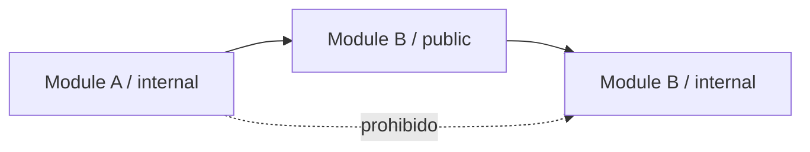

No se permite compartir Entities o Aggregate Roots, acceder al `DbContext` de otro módulo, consultar sus tablas directamente ni referenciar sus Handlers internos. La composición en el host puede conocer los módulos para registrar dependencias, pero no convierte su implementación en API pública ni elimina los límites semánticos entre contextos.

## Seguridad arquitectónica

### Cliente

- No utiliza autenticación ni posee cuenta, roles o permisos.
- Consume endpoints públicos de lectura y puede enviar el formulario público de contacto.
- No puede modificar contenido administrado ni controlar destinatarios o configuración del correo.

### Administrador

- Utiliza exclusivamente la autenticación de Directus.
- Directus debe operar sobre HTTPS y limitarse a uno o dos Administradores autorizados.
- Las credenciales son individuales y no deben compartirse.
- No se conecta manualmente a PostgreSQL; opera a través de Directus Data Studio.
- Sus roles, policies y permissions deben limitar colecciones, archivos y acciones, sin privilegios irrestrictos para modificar el Data Model.

### ASP.NET Core API

- En la V1 no implementa login, registro, roles, permisos ni panel administrativo.
- Expone lecturas públicas, el caso de uso público de contacto y casos de uso administrativos consumidos por Directus.
- Valida parámetros de entrada y no revela detalles internos de Directus o PostgreSQL.
- Debe autenticar y autorizar a Directus antes de producción; el mecanismo sigue pendiente.
- Puede consultar estado actual mediante EF Core durante un Command, pero no realiza con `SaveChanges` la escritura final de esa misma mutación.
- Invoca el correo mediante un port de Application; no expone credenciales, stack traces ni detalles del proveedor.
- Usa HTTPS en producción, secretos únicamente mediante variables de entorno y credenciales de base de datos con mínimo privilegio.

### PostgreSQL

- No es accesible directamente por el Cliente ni por Administradores humanos.
- Es accesible técnicamente por ASP.NET Core/EF Core y por Directus con mínimo privilegio.
- Las lecturas administrativas las realiza Directus; las mutaciones administrativas las persiste Directus después de la aprobación del Filter Hook.
- Aplica constraints estructurales y credenciales de mínimo privilegio.
- No se expone directamente a Internet.

## Rendimiento

- Consultas asíncronas, cancelables y proyectadas.
- `AsNoTracking()` para lecturas que no requieran tracking.
- Prevención de N+1 y paginación cuando el volumen lo requiera.
- Optimización de recursos multimedia.
- Caching únicamente con objetivos, invalidez y métricas definidos.
- Ninguna optimización prematura que debilite claridad o límites.

## Testabilidad de las fronteras

- Los tests de Domain ejercitan invariantes y comportamiento sin SMTP, base de datos, reloj del sistema, HTTP ni Directus.
- Los tests de Application sustituyen ports con implementaciones deterministas, como `FakeClock` o `FakeEmailSender` cuando esos contratos existan.
- Los tests de Infrastructure verifican por separado la traducción de fallos, mappings e integración real con PostgreSQL o proveedores cuando corresponda.
- Los tests de Presentation verifican el mapping seguro de resultados y errores al contrato HTTP sin depender de detalles internos.

Estos nombres de fakes describen una técnica de test, no fijan un framework ni crean tipos antes de que exista la infraestructura de pruebas.

## Decisiones vigentes

Las decisiones aprobadas son: monolito modular, los cuatro Bounded Contexts iniciales, DDD pragmático, arquitectura hexagonal con dependencias hacia el núcleo, .NET 10 y proyectos separados por capa, CQRS con MediatR, EF Core como autoridad del esquema PostgreSQL, Persistence separado de Domain, tres `DbContext` y schemas con migrations propias, ausencia de persistencia para Contact, referencias UUID opacas entre Portfolio y Services, Directus conectado al esquema del dominio, Filter Hooks bloqueantes para mutaciones administrativas, React modular como frontend público y contenido institucional estático en código. Su contexto y consecuencias están registrados en [DECISIONS.md](DECISIONS.md).

## Decisiones abiertas

- Versiones de React, PostgreSQL, Directus y dependencias externas distintas de EF Core/Npgsql.
- Controllers o Minimal APIs.
- Límites transaccionales de futuros casos de uso.
- Efecto de desactivar Service/ServiceCategory sobre Projects históricos relacionados.
- Exposición pública de `ProjectPeriod`: fechas, duración o ninguna.
- Estructura física final del frontend, routing, providers y herramientas adicionales.
- Implementación de almacenamiento de imágenes/videos y posible uso de URLs externas.
- Permisos, metadata y configuración operativa de Directus.
- Mecanismo de autenticación y autorización Directus → ASP.NET Core.
- Detalles de implementación y cobertura de Filter Hooks por colección/operación.
- Contrato definitivo del formulario y catálogo final de tipos de solicitud.
- Proveedor de correo, configuración técnica de `From`, asunto y plantillas. `To` procede de CompanyProfile y `Reply-To` del solicitante.
- Política antiabuso del formulario: rate limiting, spam, automatización, límites y posible CAPTCHA si se justifica.
- Necesidad o no de persistencia histórica de solicitudes de contacto.
- Estrategia y frameworks de testing.
- Desarrollo local, contenedores y deployment.
- Observabilidad, caching y políticas de paginación.

Estas decisiones no deben asumirse durante una tarea no relacionada. Cuando sean aprobadas, se registrarán en [DECISIONS.md](DECISIONS.md) y se actualizará esta fuente de verdad.
