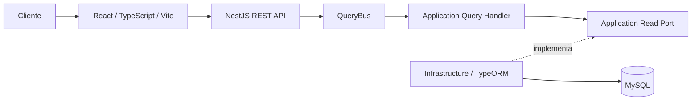
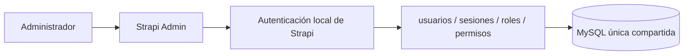
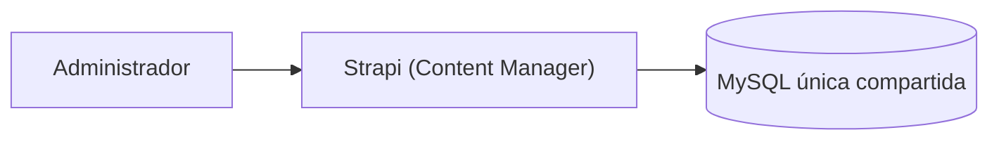
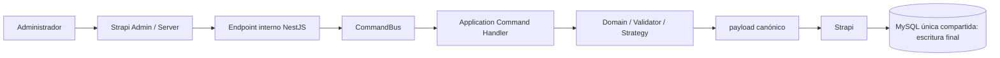
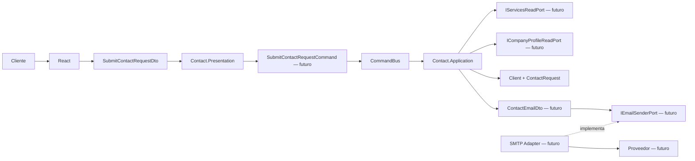
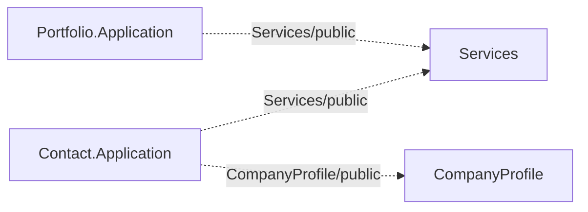
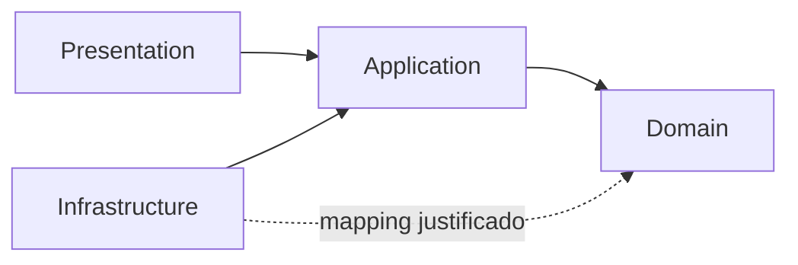
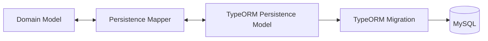
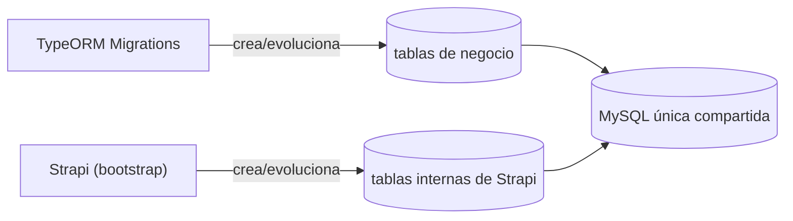

# Arquitectura

Este documento es la fuente de verdad de la arquitectura vigente de Cromática Creativa.

## Estado implementado

- Frontend público: objetivo futuro React, TypeScript, Vite, HTML5 y CSS; no implementado.
- Backend: Node.js 22, TypeScript y NestJS REST.
- Estilo: monorepo, monolito modular, DDD pragmático y arquitectura hexagonal.
- CQRS in-process: `@nestjs/cqrs`, `CommandBus`, `QueryBus`, Command Handlers y Query Handlers.
- Persistencia: TypeORM sobre MySQL, con TypeORM Migrations como autoridad estructural.
- CMS administrativo: **Strapi 5** (TypeScript) incorporado en `infrastructure/CMS/Strapi/`, que comparte **una sola base MySQL** con el backend pero gobierna únicamente sus tablas internas; las **TypeORM migrations** siguen siendo la autoridad estructural de las tablas de negocio (ADR-025 y ADR-027). Provisional hasta superar la PoC en el **Hostinger Business Web Hosting existente**. Directus fue retirado definitivamente.

La fundación anterior fue reemplazada y retirada del árbol activo. El backend NestJS, Domain TypeScript, `@nestjs/cqrs`, TypeORM/MySQL, diez Persistence Models, cinco mappers, tres migrations modulares y tests están implementados. HU22 "Agregar información de contacto" y HU24 "Agregar ubicación" (más HU23 "Modificar información de contacto" y HU25 "Modificar ubicación") añaden los primeros casos de uso reales en CompanyProfile. El correo receptor también atraviesa `AgregarInformacionDeContactoCommand`, una Strategy propia y el mismo Aggregate; no tiene Command/Handler paralelo. HU23 usa un único `ModificarInformacionDeContactoCommand` orquestador con `ModificarTelefono/Correo/RedSocialStrategy` (reutilizando las validaciones de Agregar) y HU25 `ModificarUbicacionCommand` (flujo único); el Domain expone `changePhone/changeEmail/changeSocialLink` por valor y el id→valor se resuelve en Infrastructure sin introducir ids en el Domain. Toda esa lógica de negocio permanece intacta tras retirar Directus; solo su frontera HTTP interna (`CompanyProfileCmsController`) dejó de estar registrada, pendiente de la integración con Strapi (ADR-025). Tras ADR-027, Strapi y el backend comparten **una sola base MySQL** con **ownership separado**: las TypeORM migrations siguen siendo la autoridad estructural de las diez tablas de negocio (registradas, `synchronize: false`) y Strapi gobierna solo sus tablas internas. NestJS conserva las reglas de negocio (CREATE/UPDATE) y MySQL el enforcement estructural; en una fase posterior Strapi accederá a los datos de negocio mediante infraestructura custom. Strapi compila (`npm run build`); su ejecución completa se verifica solo con la base MySQL real disponible.

## Estructura física

```text
project-cromaticacreativa-web/
├── backend/                              # aplicación NestJS
│   └── src/
│       ├── modules/
│       │   └── {Context}/
│       │       ├── {Context}.Domain/
│       │       ├── {Context}.Application/
│       │       ├── {Context}.Infrastructure/
│       │       ├── {Context}.Presentation/
│       │       ├── {Context}.Commons/
│       │       └── {Context}Module.ts
│       ├── Infrastructure/               # capa técnica interna de NestJS
│       │   ├── Configuration/DatabaseConfiguration.ts
│       │   └── Persistence/TypeOrmDataSource.ts
│       ├── AppModule.ts
│       └── main.ts
└── infrastructure/                       # infraestructura externa del sistema
    └── CMS/
        └── Strapi/                       # CMS Strapi 5 (proceso Node independiente; base MySQL compartida)
            ├── package.json
            ├── package-lock.json
            ├── tsconfig.json
            ├── .env.example
            ├── README.md
            ├── config/                   # server, admin, database (STRAPI_DB_*), plugins, middlewares
            ├── src/
            ├── database/
            └── public/
```

Las dos rutas llamadas Infrastructure tienen alcances distintos: `backend/src/Infrastructure/` pertenece a la arquitectura hexagonal interna de NestJS; `infrastructure/CMS/Strapi/` contiene una aplicación externa completa, con proceso, dependencias, configuración, base de datos y deployment propios. Strapi no adopta las capas Domain/Application/Infrastructure/Presentation ni la nomenclatura de Bounded Context.

Las carpetas aún sin código real contienen únicamente `.gitkeep`; no se crean ceremonialmente. `Domain/Abstract` contiene solo interfaces con prefijo `I`; las bases locales de igualdad y validación UUID están en `Domain/ValueObjects/Base`. `Application/Ports` y `Application/Validations` permanecen vacías hasta el primer caso de uso. Cada `{Context}.Commons/DTOs` es local y aloja contratos planos internos compartidos por adaptadores/mappers del contexto; no representa HTTP ni es una capa hexagonal adicional. Los DTOs de transporte HTTP viven en Presentation únicamente cuando existe una frontera real. Domain no depende de ninguno. Actualmente `CompanyProfile.Presentation` contiene `Controllers` y `Mappers`; `Contact.Presentation` contiene esas carpetas y `DTOs/SubmitContactRequestDto.ts`. No existen Shared Kernel, Commons global, `src/database` ni una capa global propietaria del modelo persistente.

```text
CompanyProfile.Presentation/       Contact.Presentation/
├── Controllers/                   ├── Controllers/
└── Mappers/                       ├── DTOs/
                                  │   └── SubmitContactRequestDto.ts
                                  └── Mappers/
```

## Actores y alcance

- **Cliente**: actor público sin cuenta, autenticación, perfil, roles o permisos persistidos. Consulta el sitio y envía el formulario.
- **Administrador**: personal autorizado con una cuenta previamente configurada en Strapi; no es una identidad de Domain, NestJS o React.
- `Client`: Entity interna y efímera de Contact que representa los datos validados de una solicitud; su `ClientId` no viene del frontend ni se persiste, y Application/composition proporcionará su UUID al construirla.
- `CorporateClient`: empresa o marca del portafolio; no es el actor Cliente.

La V1 excluye cuentas de Cliente, login, roles propios, panel administrativo React, comercio electrónico y pagos. Los textos institucionales poco cambiantes permanecen en código.

## Vista de alto nivel

### Lectura pública



Las Queries son de solo lectura, no producen efectos, seleccionan únicamente datos públicos y proyectan DTOs. No reconstruyen un Aggregate cuando una proyección basta y deben evitar N+1.

### Autenticación administrativa



Las cuentas, sesiones, roles y permisos administrativos viven en Strapi, sobre la
base MySQL única compartida. NestJS no ofrece endpoint, JWT, usuario, rol o sesión
administrativa, y React no ofrece login o registro administrativo. El registro
público permanece deshabilitado por defecto.

### Lectura y eliminación administrativas (GET / DELETE)



Strapi resuelve GET y DELETE del contenido administrable directamente contra MySQL,
sin pasar por NestJS. NestJS no se convierte en un CRUD para satisfacer al CMS.

### CREATE / UPDATE con reglas de negocio (objetivo, pendiente)



Flujo para CREATE/UPDATE que requieren negocio. NestJS es la autoridad de reglas e
invariantes: valida y canonicaliza, y devuelve el payload canónico; Strapi ejecuta
la **escritura final** (mismo flujo conceptual que se tenía con Directus). Para
**CompanyProfile** esto ya está implementado (ADR-028): `CompanyProfileCmsController`
está registrado y protegido por `CmsServiceAuthGuard` (token técnico
service-to-service), y en Strapi las rutas admin server-side, el Admin UI
"Información General", OSM y el branding están implementados y cargados por el build.
Portfolio y Services aún no tienen integración CMS. El principio de fondo de ADR-019
(las mutaciones de negocio pasan por Application/Domain, sin doble escritura) se conserva.

### Formulario público de contacto



El diagrama completo es objetivo, no estado actual. Solo están materializados `SubmitContactRequestDto`, `Client`, `ContactRequest`, `TipoSolicitud` y sus Value Objects; Command, ports, contratos `public/`, `ContactEmailDto`, adapter y endpoint siguen pendientes. El CMS (Strapi) no participa. `Client` y `ContactRequest` no presuponen persistencia histórica. El futuro `From` será configuración técnica, el `To` vendrá de CompanyProfile y el `Reply-To` será el correo validado de `Client`.

## Monolito modular y Bounded Contexts

Los cuatro Bounded Contexts son definitivos para esta fase:

| Contexto | Ownership |
| --- | --- |
| `Portfolio` | Trabajo realizado, Projects, multimedia real y CorporateClients. |
| `Services` | Oferta comercial y categorías de servicio. |
| `CompanyProfile` | Datos públicos administrables, ubicación, redes y destinatario del formulario. |
| `Contact` | Procesamiento del formulario público. |

Compartir proceso o base no permite compartir Entities/Aggregates o consultar tablas de otro contexto. Las interacciones futuras atravesarán contratos mínimos de `public/` con consumidores reales; aún no se han materializado. No existen contextos independientes `Projects`, `CorporateClients`, `Categories`, `Location` o `Media`.



## Modelo de dominio preservado

### Portfolio

- `Project` y `CorporateClient` son Aggregate Roots.
- `ProjectMedia` es Entity interna de `Project`; su colección se modifica mediante el Root.
- `Project` conserva como máximo una referencia a un CorporateClient principal.
- `ProjectPeriod` contiene `StartDate`, `EndDate` y `TotalDays` derivado, y protege `EndDate >= StartDate`.
- `PublicationStatus` (`Draft`/`Published`) expresa publicación y no se reutiliza para estados comerciales.
- `ProjectServiceReference` y `ProjectCategoryReference` son Value Objects propios; Portfolio.Domain no depende de Services.Domain.
- Portfolio.Application valida existencia, pertenencia y estado mediante `Services/public/`.

### Services

- `Service` y `ServiceCategory` son Aggregate Roots.
- Cada ServiceCategory pertenece exactamente a un Service y tiene ciclo de vida propio.
- `ServiceStatus` y `ServiceCategoryStatus` usan `Active`/`Inactive`.
- Solo se exponen Services Active y categorías Active cuyo Service padre esté Active.
- `ReferenceImage` es ilustrativa del tipo de trabajo; no representa un Project ni equivale a `ProjectMedia`.
- El efecto de desactivar Service/ServiceCategory sobre Projects históricos permanece abierto.

### CompanyProfile

- `CompanyContactInformation` es Aggregate Root.
- `phones` y `emails` son colecciones readonly de Value Objects públicos, sin duplicados por valor.
- `SocialLink` es Value Object inmutable compuesto por red y URL; la red es única dentro del Aggregate. WhatsApp se representa aquí, no como teléfono especial.
- `CompanyLocation` es un Value Object compuesto por `Address` y `GeoCoordinates` obligatorias. La ubicación completa es opcional y puede reemplazarse; no posee identidad Domain.
- `ContactRequestRecipientEmail` es exactamente un correo operativo interno y no forma parte automáticamente de `emails`.
- El destinatario es interno al monolito, distinto del correo público y del `From` técnico.

### Contact

- `Client` es Entity interna, no una cuenta: posee `ClientId` generado internamente, `PersonName`, empresa opcional normalizada, `EmailAddress` y `PhoneNumber`.
- `ContactRequest` es Aggregate Root y compone `Client`, `TipoSolicitud`, `requestedService` y mensaje opcional normalizado.
- `TipoSolicitud` usa exclusivamente `SOLICITUD_INFORMACION` y `SOLICITUD_SERVICIO`.
- La identidad de `Client` no procede del frontend ni de MySQL. La condición de Root de la solicitud no implica tabla o historial para ninguno.
- Domain no envía correo ni conoce proveedores.
- Contact.Application validará Services, obtendrá el destinatario desde CompanyProfile y coordinará correo cuando se implemente el caso de uso; sus ports no se crean anticipadamente.

## Arquitectura hexagonal



### Domain

Contiene lenguaje, invariantes y comportamiento. No depende de NestJS, `@nestjs/cqrs`, TypeORM, MySQL, el CMS (Strapi), HTTP, correo, storage ni `node:crypto`. No recibe decoradores técnicos. Sus mensajes de negocio se escriben en español y sus Value Objects preservan igualdad por valor mediante abstracciones locales, no compartidas entre contextos. `UuidValueObject` recibe, normaliza y valida UUID no vacíos; la generación del valor corresponde a Application/composition y no a Domain.

### Application

Orquesta Domain, declara capacidades externas en `Ports` y separa validaciones de caso de uso en `Validations`. Usa Commands para acciones y Queries para lecturas sin efectos. No conoce TypeORM ni adaptadores concretos. Estas carpetas no contienen artefactos funcionales hasta que exista un caso real.

### Presentation

Los controllers traducen HTTP, mapean Request/Response DTOs de `{Context}.Presentation/DTOs` y delegan a `CommandBus` o `QueryBus`. No contienen reglas de negocio ni acceden a repositorios/TypeORM. Esos contratos HTTP son distintos de los DTOs internos de `{Context}.Commons/DTOs`, usados entre adaptadores/mappers; Domain no depende de ninguno.

### Infrastructure

Implementa persistencia, mappers y adaptadores. Puede depender de Application y, cuando un mapping real lo exige, del Domain de su propio contexto. No contiene reglas de negocio.

## CQRS con `@nestjs/cqrs`

```text
HTTP → Controller → CommandBus / QueryBus → Handler → Domain / Application Port
                                                        ↑
                                           Infrastructure implementa
```

- `CommandHandler` procesa una intención o efecto autorizado.
- `QueryHandler` produce una proyección de solo lectura.
- No se crean Commands/Queries artificiales ni CRUD ceremonial.
- CQRS no implica Event Sourcing; Event Sourcing no forma parte de la arquitectura.
- Domain Events solo representan hechos relevantes y los Integration Events requieren consumidor real.
- Cuando un Command tiene variantes extensibles por tipo, el Handler puede resolver una colección de estrategias inyectadas (patrón Strategy) para permanecer como orquestador y respetar OCP. No es una obligación global. Ejemplo vigente: `AgregarInformacionDeContactoCommandHandler → colección de Strategies → Strategy por tipo → Aggregate`.

## Persistencia TypeORM/MySQL



El modelo relacional y el de Domain son deliberadamente distintos. Las clases con decoradores TypeORM viven solo en Infrastructure; no se mapean directamente Aggregate Roots, Entities o Value Objects de Domain.

`synchronize: true` está prohibido en producción y `synchronize` permanece `false`.

La aplicación usa un único `DataSource` técnico en `src/Infrastructure/Persistence/TypeOrmDataSource.ts` sobre la base MySQL única compartida. Los Persistence Models se registran con `TypeOrmModule.forFeature(...)` para **lectura/reconstrucción de estado** en las validaciones de negocio; ningún módulo consume modelos internos de otro.

### Ownership del schema (ADR-027)

**TypeORM Migrations es la única autoridad estructural** de las diez tablas de
negocio, sobre la base MySQL única compartida. Las tres migrations por módulo están
**registradas** en el DataSource y crean/evolucionan esas tablas; `synchronize`
permanece `false`. Strapi comparte la misma base, pero gobierna **solo sus tablas
internas** (bootstrap) y **no** modela las tablas de negocio como content-types.



Clasificación de tablas: **A) internas de Strapi** = las que crea su bootstrap;
**B) de negocio** = las diez, autoridad de TypeORM; **C) futuras** = ninguna. La
infraestructura custom de Strapi que en una fase posterior lea/escriba los **datos**
de las tablas de negocio no altera su estructura.

Reparto de validación: **MySQL** aplica NOT NULL/UNIQUE/FK/CHECK/tipos definidos por
las migrations. **NestJS** conserva las reglas de negocio (teléfono E.164 con
`libphonenumber-js`, canonicalización, duplicados semánticos, unicidad compuesta
`category(service_id,name)`, portada única de `media`, `end>=start`,
`published⇒title`, coherencia de las referencias opacas `serviceId/categoryId`).

Los UUID persistidos se almacenan como `CHAR(36) CHARACTER SET ascii COLLATE ascii_bin`: legibles, uniformes y soportados por TypeORM. `ClientId` es solo identidad efímera de Domain y no tiene columna. `CalendarDate` mapea a `DATE` como `YYYY-MM-DD`, sin hora ni conversión por zona.

CompanyProfile guarda el destinatario interno en la raíz `company_profile`; phone/email son colecciones públicas ordenadas con FK hija; WhatsApp vive en social_link; y location usa `company_profile_id` como PK/FK. Contact no contiene migration ni tabla funcional.

La portada única de Portfolio se protege con la columna generada nullable `media.cover_marker = CASE WHEN is_cover = 1 THEN 1 ELSE NULL END` y `UNIQUE (project_id, cover_marker)`. Como la expresión no depende de `project_id`, MySQL 8.4 conserva `fk_media_project` con `ON DELETE CASCADE`.

No existen schemas PostgreSQL, FKs cruzadas o dependencias Infrastructure → Infrastructure. Los modelos implementan DTOs de persistencia planos de su `{Context}.Commons` y los mappers reciben esos contratos sin convertirlos en modelos Domain. `Client` y `ContactRequest` continúan sin persistencia histórica aprobada. Los límites transaccionales futuros permanecen abiertos.

## Strapi provisional y PoC

Strapi está incorporado y compila (`npm run build`), pero todavía no es una capacidad adoptada para producción. La PoC debe realizarse en el **Hostinger Business Web Hosting existente**. No se afirma que Strapi esté desplegado, funcione allí o sea oficialmente soportado para esta topología.

La lógica de negocio de HU22–HU25 (Commands, Handlers, Strategies, Validadoras, `ICompanyProfileStateReader` y la frontera HTTP interna `CompanyProfileCmsController`) permanece intacta en NestJS. Para CompanyProfile, esa frontera está **registrada y protegida** por `CmsServiceAuthGuard` (token técnico service-to-service; ADR-028) e incluye `initialize`. Permanecen abiertos el Admin UI/OSM/branding de Strapi, los permisos CRUD finos, la verificación E2E y el deployment; Portfolio/Services no tienen integración CMS.

La PoC debe verificar:

1. ejecución de Node.js 22 como aplicación Node administrada;
2. conexión a la base MySQL/MariaDB única compartida con el backend;
3. inicialización de las tablas internas de Strapi (bootstrap);
4. funcionamiento del panel de administración;
5. autenticación de administradores y roles/permisos;
6. `npm run build` y arranque (`npm run start`) en el entorno;
7. persistencia y comportamiento de uploads;
8. supervivencia de uploads y configuración tras reinicio o redeploy;
9. (fase posterior) integración administrativa custom Strapi → NestJS y su autenticación service-to-service.

Si falla, se reconsiderará el CMS mediante una ADR futura; esta arquitectura no selecciona una alternativa. La autenticación técnica CMS → NestJS se definirá en la fase de integración de Strapi (ADR-025); permisos CRUD finos, almacenamiento y operación continúan abiertos.

## Frontend React/Vite — fase futura

El frontend no está implementado. React + TypeScript + Vite será el único cliente web público cuando se materialice en una tarea posterior. Usará HTML semántico, CSS responsive y acceso HTTP centralizado en services/API clients. `app`, `pages`, `features`, `components`, `hooks`, `services`, `types`, `utils` y `assets` se materializarán solo con responsabilidades reales; no se replica la arquitectura hexagonal del backend.

```text
Page / Component → Feature / Hook → Service / API client → NestJS REST
```

React nunca consume Strapi o MySQL, no conoce endpoints internos, credenciales o destinatarios y no envía correo directamente. Sus tipos representan contratos HTTP o necesidades de UI, no clases de Domain.

## DTOs, validación y errores

```text
Request DTO → Command / Query → Handler → Domain
Projection / Domain → Response DTO → HTTP → TypeScript type
```

- React y el CMS (Strapi) aportan UX.
- Presentation protege y traduce la frontera HTTP.
- Application valida entrada, existencia, precondiciones y coherencia.
- Domain protege invariantes.
- MySQL aplica integridad estructural.
- Infrastructure traduce fallos técnicos; Presentation no filtra stack traces, SQL, secretos o detalles del proveedor.
- Un Presentation DTO representa transporte HTTP —por ejemplo `SubmitContactRequestDto` o un futuro `GetProjectsResponseDto`—. Un Commons DTO representa un contrato plano interno de adaptador/persistencia —por ejemplo `ProjectPersistenceDto` o `CompanyProfilePersistenceDto`— y no es HTTP.

## Seguridad y rendimiento

- Cliente sin autenticación; no puede mutar contenido administrado.
- Administrador usa el CMS (Strapi); no se crea autenticación NestJS propia para personas en V1.
- La autenticación service-to-service CMS (Strapi) → NestJS se definirá en la fase de integración de Strapi (ADR-025); en esta fase la frontera interna no está expuesta.
- MySQL y secretos no se exponen al Cliente ni se versionan.
- Lecturas proyectadas, cancelación cuando aplique, prevención de N+1 y paginación solo con necesidad real.
- Caching, observabilidad y optimización se incorporan con métricas y requisitos.

## Decisiones vigentes y abiertas

Vigentes: monolito modular, arquitectura hexagonal física por contexto, ownership modular de persistencia/migrations, un DataSource técnico, ausencia de Shared Kernel, cuatro Bounded Contexts, React público futuro, contenido institucional estático, Node.js 22/NestJS/TypeScript, `@nestjs/cqrs`, deployment objetivo en el Hostinger Business Web Hosting existente, **base MySQL única compartida** con **ownership separado**: TypeORM migrations como autoridad estructural de las tablas de negocio (registradas, `synchronize: false`) y Strapi como CMS administrativo dueño solo de sus tablas internas, NestJS como autoridad de reglas de negocio (CREATE/UPDATE via Application/Domain) y MySQL como enforcement estructural (ADR-025 y ADR-027).

Abiertas: resultado de la PoC de Strapi, integración administrativa custom Strapi → NestJS y su autenticación service-to-service, permisos CRUD finos del CMS, endpoints públicos, storage, correo, antiabuso, historial de ContactRequest, exposición de ProjectPeriod, efecto de desactivar categorías, transacciones, observabilidad y operación. La aplicación de la migration contra una instancia MySQL real también está pendiente de entorno.

El historial y estado formal se encuentran en [DECISIONS.md](DECISIONS.md).
